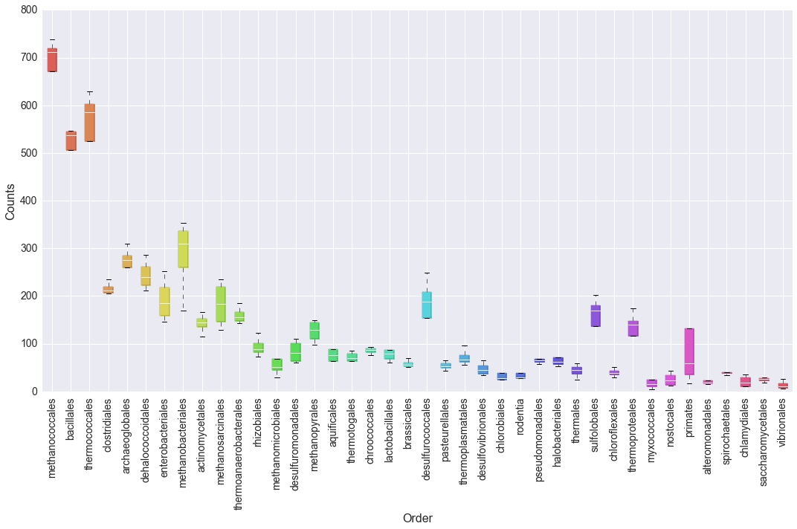
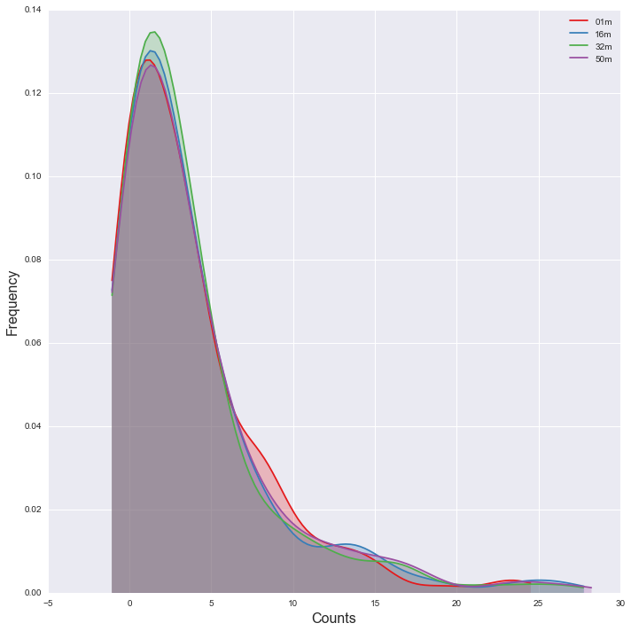
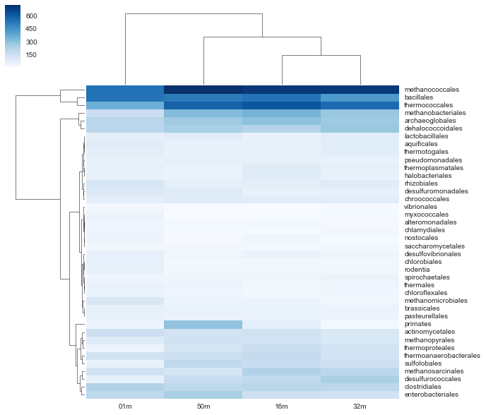
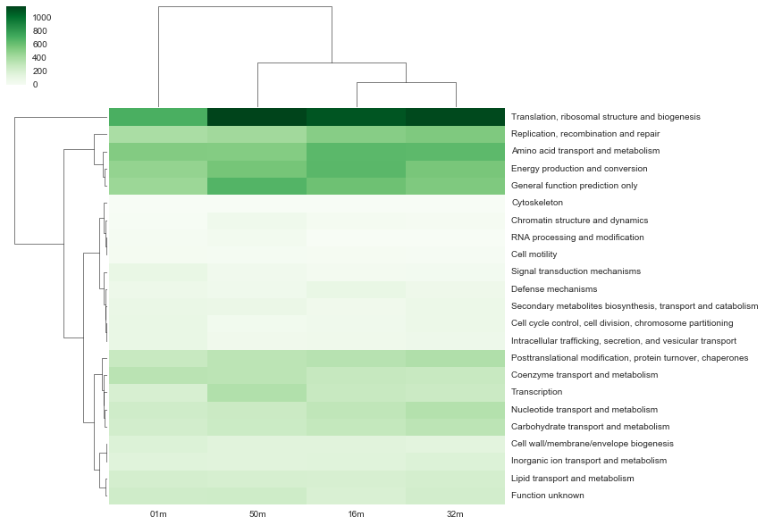
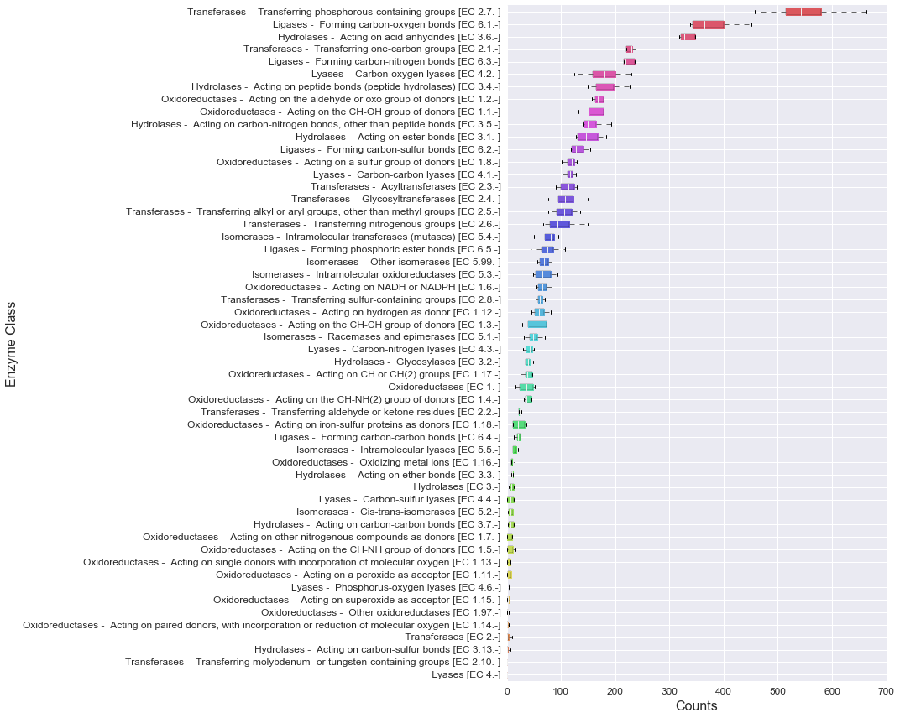
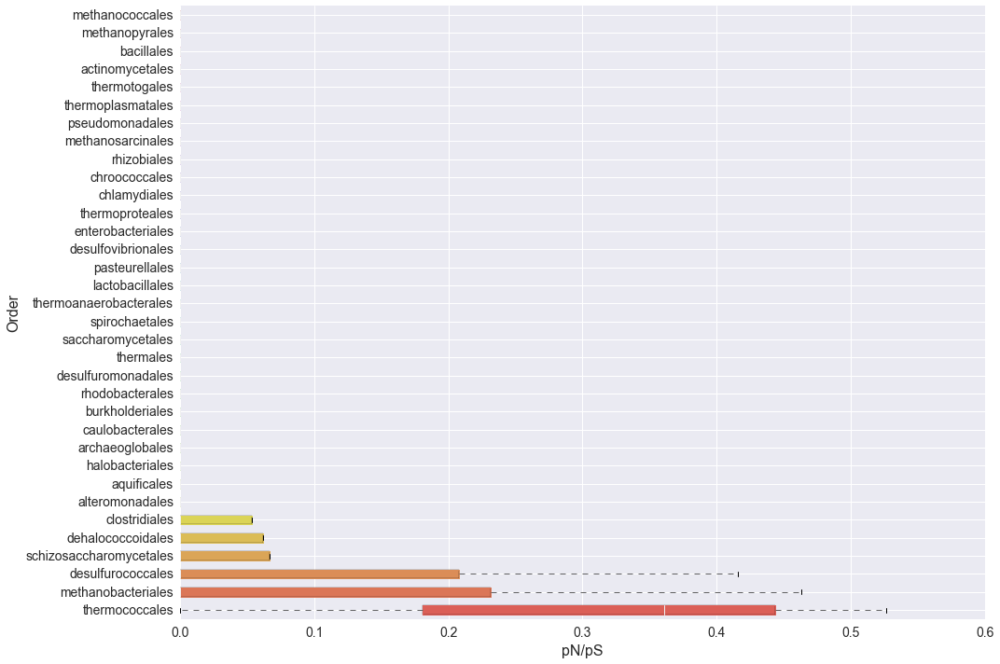
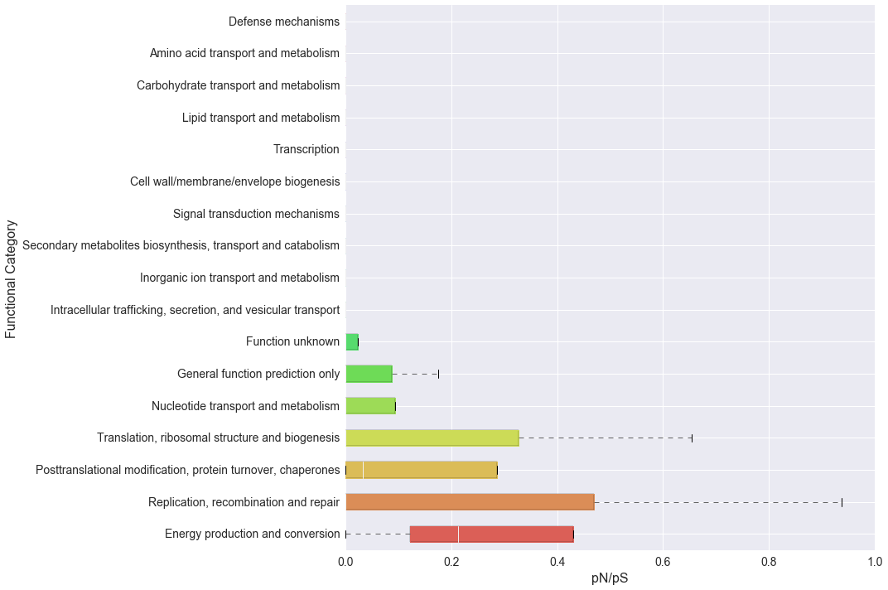
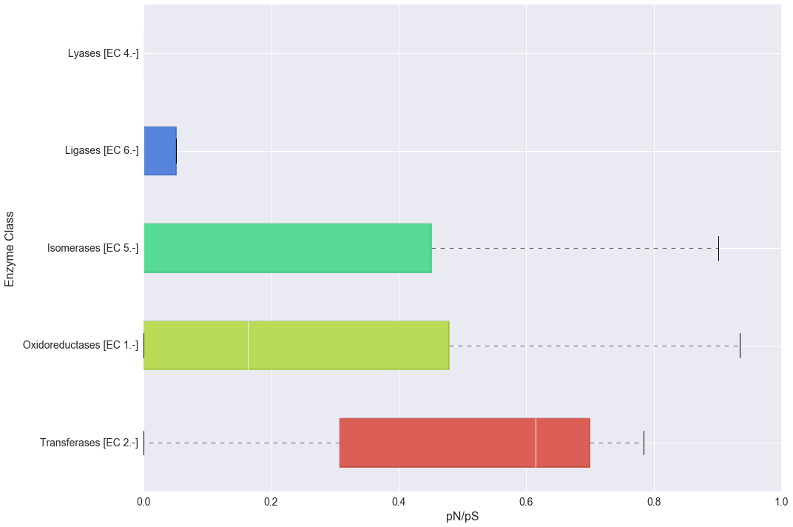

Tutorial - Exploring the Data
=============================

The following section requires that:

-  the tutorial has been completed
-  the data from it is in the same directory

In alternative the data required to run this example can be download
from `figshare <http://files.figshare.com/2598711/tutorial_data.zip>`__
and uncrompressed.

Imports
-------

.. code:: ipython2

    from __future__ import print_function
    
    #Python Standard Library
    import glob
    import pickle
    import sys
    
    #External Dependencies (install via pip or anaconda)
    
    # Check if running interactively or not
    import matplotlib as mpl # http://matplotlib.org
    # from:
    # http://stackoverflow.com/questions/15411967/how-can-i-check-if-code-is-executed-in-the-ipython-notebook
    # and
    # http://stackoverflow.com/questions/15455029/python-matplotlib-agg-vs-interactive-plotting-and-tight-layout
    import __main__ as main
    if hasattr(main, '__file__'):
        # Non interactive, force the use of Agg backend instead
        # of the default one
        mpl.use('Agg')
    
    import numpy # http://www.numpy.org
    import pandas # http://pandas.pydata.org
    import seaborn # http://stanford.edu/~mwaskom/software/seaborn/
    import scipy # http://www.scipy.org
    import matplotlib.pyplot as plt 
    
    
    #MGKit Import
    from mgkit.io import gff, fasta
    from mgkit.mappings import eggnog
    import mgkit.counts, mgkit.taxon, mgkit.snps, mgkit.plots
    import mgkit.snps
    import mgkit.mappings.enzyme

.. parsed-literal::

    /Users/francesco/dev/dev-env/lib/python2.7/site-packages/matplotlib/__init__.py:872: UserWarning: axes.color_cycle is deprecated and replaced with axes.prop_cycle; please use the latter.
      warnings.warn(self.msg_depr % (key, alt_key))

.. code:: ipython2

    mgkit.logger.config_log()

.. code:: ipython2

    mgkit.cite(sys.stdout)

.. parsed-literal::

    
     _|      _|    _|_|_|  _|    _|  _|    _|
     _|_|  _|_|  _|        _|  _|        _|_|_|_|
     _|  _|  _|  _|  _|_|  _|_|      _|    _|
     _|      _|  _|    _|  _|  _|    _|    _|
     _|      _|    _|_|_|  _|    _|  _|      _|_|
    
    
    MGKit Version: 0.2.1
    
    Rubino, F. and Creevey, C.J. (2014).
    MGkit: Metagenomic Framework For The Study Of Microbial Communities.
    
    Available at: http://figshare.com/articles/MGkit_Metagenomic_Framework_For_The_Study_Of_Microbial_Communities/1269288
    
    [doi:10.6084/m9.figshare.1269288]
    

Download Complete Data
----------------------

If the tutorial can't be completed, the download data can be downloaded
from: %%

.. code:: ipython2

    # the following variable is used to indicate where the tutorial data is stored
    data_dir = 'tutorial-data/'

Read Necessary Data
-------------------

.. code:: ipython2

    # Keeps a list of the count data file outputted by
    # htseq-count
    counts = glob.glob('{}*-counts.txt'.format(data_dir))

.. code:: ipython2

    # This file contains the SNPs information and it is the output
    # of the snp_parser script
    snp_data = pickle.load(open('{}snp_data.pickle'.format(data_dir), 'r'))

.. code:: ipython2

    # Taxonomy needs to be download beforehand. It is loaded into an an
    # instance of mgkit.taxon.UniprotTaxonomy. It is used in filtering
    # data and to map taxon IDs to different levels in the taxonomy
    taxonomy = mgkit.taxon.UniprotTaxonomy('{}mg_data/taxonomy.pickle'.format(data_dir))

.. parsed-literal::

    INFO:mgkit.taxon:Loading taxonomy from file tutorial-data/mg_data/taxonomy.pickle
    2015-12-04 12:02:33,049 -    INFO - mgkit.taxon->load_data: Loading taxonomy from file tutorial-data/mg_data/taxonomy.pickle

.. code:: ipython2

    # Loads all annotations in a dictionary, with the unique ID (uid) as key
    # and the mgkit.io.gff.Annotation instance that represent the line in the
    # GFF file as value
    annotations = {x.uid: x for x in gff.parse_gff('{}assembly.uniprot.gff'.format(data_dir))}

.. parsed-literal::

    INFO:mgkit.io.gff:Loading GFF from file (tutorial-data/assembly.uniprot.gff)
    2015-12-04 12:02:47,406 -    INFO - mgkit.io.gff->parse_gff: Loading GFF from file (tutorial-data/assembly.uniprot.gff)

.. code:: ipython2

    # Used to extract the sample ID from the count file names
    file_name_to_sample = lambda x: x.rsplit('/')[-1].split('-')[0]

.. code:: ipython2

    # Used to rename the DataFrame columns
    sample_names = {
        'SRR001326': '50m',
        'SRR001325': '01m',
        'SRR001323': '32m',
        'SRR001322': '16m'
    }

Explore Count Data
------------------

Load Taxa Table
~~~~~~~~~~~~~~~

Build a pandas.DataFrame instance. It is NOT required, but it is easier
to manipulate. load\_sample\_counts\_to\_taxon returns a pandas.Series
instance.

The DataFrame will have the sample names as columns names and the
different taxon IDs as rows names. There are 3 different function to map
counts and annotations to a pandas.Series instance:

-  mgkit.counts.load\_sample\_counts
-  mgkit.counts.load\_sample\_counts\_to\_taxon
-  mgkit.counts.load\_sample\_counts\_to\_genes

The three differs primarly by the index for the pandas.Series they
return, which is (gene\_id, taxon\_id), taxon\_id and gene\_id,
respectively. Another change is the possibility to map a gene\_id to
another and a taxon\_id to a different rank. In this contexts, as it is
interesting to assess the abundance of each organism,
mgkit.counts.load\_sample\_counts\_to\_taxon can be used. It provides a
**rank** parameter that can be changed to map all counts to the *order*
level in this case, but can be changed to any rank in
mgkit.taxon.TAXON\_RANKS, for example *genus*, *phylum*.

.. code:: ipython2

    taxa_counts = pandas.DataFrame({
        # Get the sample names
        file_name_to_sample(file_name): mgkit.counts.load_sample_counts_to_taxon(
            # A function accept a uid as only parameter and returns only the 
            # gene_id and taxon_id, so we set it to a lambda that does
            # exactly that
            lambda x: (annotations[x].gene_id, annotations[x].taxon_id),
            # An iterator that yields (uid, count) is needed and MGKit
            # has a function that does that for htseq-count files.
            # This can be adapted to any count data file format
            mgkit.counts.load_htseq_counts(file_name),
            # A mgkit.taxon.UniprotTaxonomy instance is necessary to filter
            # the data and map it to a different rank
            taxonomy,
            # A taxonomic rank to map each taxon_id to. Must be lowercase
            rank='order',
            # If False, any taxon_id that can not be resolved at the taxonomic
            # rank requested is excluded from the results
            include_higher=False
        )
        # iterate over all count files
        for file_name in counts
    })

.. parsed-literal::

    INFO:mgkit.counts.func:Loading HTSeq-count file tutorial-data/SRR001322-counts.txt
    2015-12-04 12:02:47,882 -    INFO - mgkit.counts.func->load_htseq_counts: Loading HTSeq-count file tutorial-data/SRR001322-counts.txt
    INFO:mgkit.counts.func:Loading HTSeq-count file tutorial-data/SRR001323-counts.txt
    2015-12-04 12:02:47,963 -    INFO - mgkit.counts.func->load_htseq_counts: Loading HTSeq-count file tutorial-data/SRR001323-counts.txt
    INFO:mgkit.counts.func:Loading HTSeq-count file tutorial-data/SRR001325-counts.txt
    2015-12-04 12:02:48,041 -    INFO - mgkit.counts.func->load_htseq_counts: Loading HTSeq-count file tutorial-data/SRR001325-counts.txt
    INFO:mgkit.counts.func:Loading HTSeq-count file tutorial-data/SRR001326-counts.txt
    2015-12-04 12:02:48,118 -    INFO - mgkit.counts.func->load_htseq_counts: Loading HTSeq-count file tutorial-data/SRR001326-counts.txt

Scaling (DESeq method) and Rename Rows/Columns
^^^^^^^^^^^^^^^^^^^^^^^^^^^^^^^^^^^^^^^^^^^^^^

Because each sample has different yields in total DNA from the
sequencing, the table should be scaled. The are a few approaches, RPKM,
scaling by the minimum. MGKit offers
mgkit.counts.scaling.scale\_factor\_deseq and
mgkit.counts.scaling.scale\_rpkm that scale using the DESeq method and
RPKM respectively.

.. code:: ipython2

    # the DESeq method doesn't require information about the gene length
    taxa_counts = mgkit.counts.scale_deseq(taxa_counts)

One of the powers of pandas data structures is the metadata associated
and the possibility to modify them with ease. In this case, the columns
are named after the sample IDs from ENA and the row names are the taxon
IDs. To make it easier to analyse, columns and rows can be renamed and
sorted by name and the rows sorted in descending order by the first
colum (1 meter).

To rename the columns the dictionary **sample\_name** can be supplied
and for the rows the name of each taxon ID can be accessed through the
taxonomy instance, because it works as a dictionary and the returned
object has a **s\_name** attribute with the scientific name (lowercase).

.. code:: ipython2

    # Sorting is done through pandas
    taxa_counts = taxa_counts.rename(
        index=lambda x: taxonomy[x].s_name,
        columns=sample_names
    ).sort(axis='columns').sort(['01m'], ascending=False)

.. parsed-literal::

    /Users/francesco/dev/dev-env/lib/python2.7/site-packages/ipykernel/__main__.py:5: FutureWarning: sort(....) is deprecated, use sort_index(.....)
    /Users/francesco/dev/dev-env/lib/python2.7/site-packages/ipykernel/__main__.py:5: FutureWarning: sort(columns=....) is deprecated, use sort_values(by=.....)

.. code:: ipython2

    # the *describe* method of a pandas.Series or pandas.DataFrame
    # gives some insights into the data
    taxa_counts.describe()

.. raw:: html

    

    <table border="1" class="dataframe">
      <thead>
        <tr style="text-align: right;">
          <th></th>
          <th>01m</th>
          <th>16m</th>
          <th>32m</th>
          <th>50m</th>
        </tr>
      </thead>
      <tbody>
        <tr>
          <th>count</th>
          <td>174.000000</td>
          <td>174.000000</td>
          <td>174.000000</td>
          <td>174.000000</td>
        </tr>
        <tr>
          <th>mean</th>
          <td>32.074193</td>
          <td>37.005129</td>
          <td>34.355541</td>
          <td>38.486366</td>
        </tr>
        <tr>
          <th>std</th>
          <td>75.836221</td>
          <td>97.136199</td>
          <td>90.514214</td>
          <td>97.525346</td>
        </tr>
        <tr>
          <th>min</th>
          <td>0.000000</td>
          <td>0.000000</td>
          <td>0.000000</td>
          <td>0.000000</td>
        </tr>
        <tr>
          <th>25%</th>
          <td>0.000000</td>
          <td>0.000000</td>
          <td>0.177828</td>
          <td>0.000000</td>
        </tr>
        <tr>
          <th>50%</th>
          <td>5.551763</td>
          <td>4.207739</td>
          <td>4.979182</td>
          <td>4.761046</td>
        </tr>
        <tr>
          <th>75%</th>
          <td>23.594992</td>
          <td>24.457482</td>
          <td>21.872837</td>
          <td>25.103697</td>
        </tr>
        <tr>
          <th>max</th>
          <td>549.624516</td>
          <td>713.211745</td>
          <td>711.311764</td>
          <td>737.529306</td>
        </tr>
      </tbody>
    </table>
    

.. code:: ipython2

    #Save a CSV to disk, but Excel and other file formats are available
    taxa_counts.to_csv('{}taxa_counts.csv'.format(data_dir))

.. code:: ipython2

    # This will give an idea of the counts for each order
    taxa_counts.iloc[:20]

.. raw:: html

    

    <table border="1" class="dataframe">
      <thead>
        <tr style="text-align: right;">
          <th></th>
          <th>01m</th>
          <th>16m</th>
          <th>32m</th>
          <th>50m</th>
        </tr>
      </thead>
      <tbody>
        <tr>
          <th>methanococcales</th>
          <td>549.624516</td>
          <td>713.211745</td>
          <td>711.311764</td>
          <td>737.529306</td>
        </tr>
        <tr>
          <th>bacillales</th>
          <td>545.460694</td>
          <td>547.006058</td>
          <td>439.590670</td>
          <td>528.043283</td>
        </tr>
        <tr>
          <th>thermococcales</th>
          <td>367.804284</td>
          <td>629.056967</td>
          <td>576.162529</td>
          <td>594.697927</td>
        </tr>
        <tr>
          <th>clostridiales</th>
          <td>234.561978</td>
          <td>214.594684</td>
          <td>207.703035</td>
          <td>206.023445</td>
        </tr>
        <tr>
          <th>archaeoglobales</th>
          <td>216.518749</td>
          <td>309.268810</td>
          <td>277.411588</td>
          <td>274.409378</td>
        </tr>
        <tr>
          <th>dehalococcoidales</th>
          <td>210.966986</td>
          <td>226.165966</td>
          <td>285.947329</td>
          <td>253.633905</td>
        </tr>
        <tr>
          <th>enterobacteriales</th>
          <td>206.803164</td>
          <td>163.049883</td>
          <td>146.530223</td>
          <td>252.768260</td>
        </tr>
        <tr>
          <th>methanobacteriales</th>
          <td>169.328765</td>
          <td>353.450068</td>
          <td>290.215200</td>
          <td>330.676285</td>
        </tr>
        <tr>
          <th>actinomycetales</th>
          <td>166.552884</td>
          <td>148.322797</td>
          <td>115.232506</td>
          <td>141.100090</td>
        </tr>
        <tr>
          <th>methanosarcinales</th>
          <td>152.673477</td>
          <td>235.633379</td>
          <td>213.393529</td>
          <td>128.981064</td>
        </tr>
        <tr>
          <th>thermoanaerobacterales</th>
          <td>149.897595</td>
          <td>185.140512</td>
          <td>143.684976</td>
          <td>161.009919</td>
        </tr>
        <tr>
          <th>rhizobiales</th>
          <td>123.526722</td>
          <td>84.154778</td>
          <td>93.181841</td>
          <td>73.579802</td>
        </tr>
        <tr>
          <th>methanomicrobiales</th>
          <td>116.587018</td>
          <td>50.492867</td>
          <td>29.163782</td>
          <td>51.938684</td>
        </tr>
        <tr>
          <th>desulfuromonadales</th>
          <td>109.647315</td>
          <td>61.012214</td>
          <td>64.729371</td>
          <td>97.817854</td>
        </tr>
        <tr>
          <th>methanopyrales</th>
          <td>98.543789</td>
          <td>144.115058</td>
          <td>113.809882</td>
          <td>148.890893</td>
        </tr>
        <tr>
          <th>aquificales</th>
          <td>88.828205</td>
          <td>64.168018</td>
          <td>88.202659</td>
          <td>63.192065</td>
        </tr>
        <tr>
          <th>thermotogales</th>
          <td>76.336738</td>
          <td>63.116084</td>
          <td>86.068723</td>
          <td>63.192065</td>
        </tr>
        <tr>
          <th>chroococcales</th>
          <td>76.336738</td>
          <td>89.414452</td>
          <td>84.646100</td>
          <td>92.623986</td>
        </tr>
        <tr>
          <th>lactobacillales</th>
          <td>70.784976</td>
          <td>59.960279</td>
          <td>86.068723</td>
          <td>87.430117</td>
        </tr>
        <tr>
          <th>brassicales</th>
          <td>69.397035</td>
          <td>50.492867</td>
          <td>54.059694</td>
          <td>57.998197</td>
        </tr>
      </tbody>
    </table>
    

Plots for Top40 Taxa
~~~~~~~~~~~~~~~~~~~~

Distribution of Each Taxon Over Depth
^^^^^^^^^^^^^^^^^^^^^^^^^^^^^^^^^^^^^

How to visualise the data depends on the question we want to ask and the
experimental design. As a starting point, it may be interesting to
visualise the variation of a taxonomic order abundance over the samples.
This can be done using boxplots, among other methods.

MGKit offers a few functions to make complex plots, with a starting
point in mgkit.plots.boxplot.boxplot\_dataframe. However, as the data
produced is in fact a pandas DataFrame, which is widely supported, a
host of different specialised libraries tht offer similar functions can
be used.

.. code:: ipython2

    # A matplotlib Figure instance and a single axis can be returned 
    # by this MGKit function. It is an helper function, the axis is
    # needed to plot and the figure object to save the file to disk
    fig, ax = mgkit.plots.get_single_figure(figsize=(15, 10))
    # The return value of mgkit.plots.boxplot.boxplot_dataframe is 
    # passed to the **_** special variable, as it is not needed and
    # it would be printed, otherwise
    _ = mgkit.plots.boxplot.boxplot_dataframe(
        # The full dataframe can be passed
        taxa_counts, 
        # this variable is used to tell the function
        # which rows and in which order they need to
        # be plot. In this case only the first 40 are
        # plot
        taxa_counts.index[:40],
        # A matplotlib axis instance
        ax, 
        # a dictionary with options related to the labels
        # on both the X and Y axes. In this case it changes
        # the size of the labels
        fonts=dict(fontsize=14),
        # The default is to use the same colors for all
        # boxes. A dictionary can be passed to change this
        # in this case, the 'hls' palette from seaborn is
        # used.
        data_colours={
            x: color
            for x, color in zip(taxa_counts.index[:40], seaborn.color_palette('hls', 40))
        }
    )
    # Adds labels to the axes
    ax.set_xlabel('Order', fontsize=16)
    ax.set_ylabel('Counts', fontsize=16)
    # Ensure the correct layout before writing to disk
    fig.set_tight_layout(True)
    # Saves a PDF file, or any other supported format by matplotlib
    fig.savefig('{}taxa_counts-boxplot_top40_taxa.pdf'.format(data_dir))

.. parsed-literal::

    /Users/francesco/dev/dev-env/lib/python2.7/site-packages/matplotlib/figure.py:1718: UserWarning: This figure includes Axes that are not compatible with tight_layout, so its results might be incorrect.
      warnings.warn("This figure includes Axes that are not "

Distribution of Taxa at Each Depth
^^^^^^^^^^^^^^^^^^^^^^^^^^^^^^^^^^

Seaborn offers a KDE plot, which is useful to display the distribution
of taxa counts for each sampling depth.

.. code:: ipython2

    fig, ax = mgkit.plots.get_single_figure(figsize=(10, 10))
    # iterate over the columns, which are the samples and assign a color to each one
    for column, color in zip(taxa_counts.columns, seaborn.color_palette('Set1', len(taxa_counts.columns))):
        seaborn.kdeplot(
            # The data can transformed with the sqrt function of numpy
            numpy.sqrt(taxa_counts[column]),
            # Assign the color
            color=color,
            # Assign the label to the sample name to appear
            # in the legend
            label=column,
            # Add a shade under the KDE function
            shade=True
        )
    # Adds a legend
    ax.legend()
    ax.set_xlabel('Counts', fontsize=16)
    ax.set_ylabel('Frequency', fontsize=16)
    fig.set_tight_layout(True)
    fig.savefig('{}taxa_counts-distribution_top40_taxa.pdf'.format(data_dir))

Heatmap of the Table
^^^^^^^^^^^^^^^^^^^^

.. code:: ipython2

    # An heatmap can be created to provide information on the table
    clfig = seaborn.clustermap(taxa_counts.iloc[:40], cbar=True, cmap='Blues')
    clfig.fig.set_tight_layout(True)
    for text in clfig.ax_heatmap.get_yticklabels():
        text.set_rotation('horizontal')
    clfig.savefig('{}taxa_counts-heatmap-top40.pdf'.format(data_dir))

Functional Categories
~~~~~~~~~~~~~~~~~~~~~

Besides looking at specific taxa, it is possible to map each gene\_id to
functional categories. `eggNOG <http://eggnog.embl.de/>`__ provides
this. **v3 must be used**, as the mappings in Uniprot points to that
version.

Load Necessary Data
^^^^^^^^^^^^^^^^^^^

.. code:: ipython2

    eg = eggnog.NOGInfo()

.. code:: ipython2

    # Just a few to speed up the analysis, but other can be used
    # Should have been downloaded by the full tutorial script
    eg.load_members('{}COG.members.txt.gz'.format(data_dir))
    eg.load_members('{}NOG.members.txt.gz'.format(data_dir))
    eg.load_funccat('{}COG.funccat.txt.gz'.format(data_dir))
    eg.load_funccat('{}NOG.funccat.txt.gz'.format(data_dir))

.. parsed-literal::

    INFO:mgkit.mappings.eggnog:Reading Members from tutorial-data/COG.members.txt.gz
    2015-12-04 12:02:51,730 -    INFO - mgkit.mappings.eggnog->load_members: Reading Members from tutorial-data/COG.members.txt.gz
    INFO:mgkit.mappings.eggnog:Reading Members from tutorial-data/NOG.members.txt.gz
    2015-12-04 12:03:08,104 -    INFO - mgkit.mappings.eggnog->load_members: Reading Members from tutorial-data/NOG.members.txt.gz
    INFO:mgkit.mappings.eggnog:Reading Functional Categories from tutorial-data/COG.funccat.txt.gz
    2015-12-04 12:03:18,667 -    INFO - mgkit.mappings.eggnog->load_funccat: Reading Functional Categories from tutorial-data/COG.funccat.txt.gz
    INFO:mgkit.mappings.eggnog:Reading Functional Categories from tutorial-data/NOG.funccat.txt.gz
    2015-12-04 12:03:18,683 -    INFO - mgkit.mappings.eggnog->load_funccat: Reading Functional Categories from tutorial-data/NOG.funccat.txt.gz

.. code:: ipython2

    #Build mapping Uniprot IDs -> eggNOG functional categories
    fc_map = {
        # An Annotation instance provide a method to access the list of IDs for the
        # specific mapping. For example eggnog mappings are store into the
        # map_EGGNOG attribute
        annotation.gene_id: eg.get_nogs_funccat(annotation.get_mapping('eggnog'))
        for annotation in annotations.itervalues()
    }

Build FC Table
^^^^^^^^^^^^^^

As mentioned above, mgkit.counts.load\_sample\_counts\_to\_genes works
in the same way as mgkit.counts.load\_sample\_counts\_to\_taxon, with
the difference of giving **gene\_id** as the only index.

In this case, however, as a mapping to functional categories is wanted,
to the **gene\_map** parameter a dictionary where for each *gene\_id* an
iterable of *mappings* is assigned. These are the values used in the
index of the returned pandas.Series, which ends up as rows in the
**fc\_counts** DataFrame.

.. code:: ipython2

    fc_counts = pandas.DataFrame({
        file_name_to_sample(file_name): mgkit.counts.load_sample_counts_to_genes(
            lambda x: (annotations[x].gene_id, annotations[x].taxon_id),
            mgkit.counts.load_htseq_counts(file_name),
            taxonomy,
            gene_map=fc_map
        )
        for file_name in counts
    })

.. parsed-literal::

    INFO:mgkit.counts.func:Loading HTSeq-count file tutorial-data/SRR001322-counts.txt
    2015-12-04 12:03:18,997 -    INFO - mgkit.counts.func->load_htseq_counts: Loading HTSeq-count file tutorial-data/SRR001322-counts.txt
    INFO:mgkit.counts.func:Loading HTSeq-count file tutorial-data/SRR001323-counts.txt
    2015-12-04 12:03:22,464 -    INFO - mgkit.counts.func->load_htseq_counts: Loading HTSeq-count file tutorial-data/SRR001323-counts.txt
    INFO:mgkit.counts.func:Loading HTSeq-count file tutorial-data/SRR001325-counts.txt
    2015-12-04 12:03:22,534 -    INFO - mgkit.counts.func->load_htseq_counts: Loading HTSeq-count file tutorial-data/SRR001325-counts.txt
    INFO:mgkit.counts.func:Loading HTSeq-count file tutorial-data/SRR001326-counts.txt
    2015-12-04 12:03:22,602 -    INFO - mgkit.counts.func->load_htseq_counts: Loading HTSeq-count file tutorial-data/SRR001326-counts.txt

Scale the Table and Rename Rows/Columns
^^^^^^^^^^^^^^^^^^^^^^^^^^^^^^^^^^^^^^^

.. code:: ipython2

    fc_counts = mgkit.counts.scale_deseq(fc_counts).rename(
        columns=sample_names,
        index=eggnog.EGGNOG_CAT
    )

.. code:: ipython2

    fc_counts.describe()

.. raw:: html

    

    <table border="1" class="dataframe">
      <thead>
        <tr style="text-align: right;">
          <th></th>
          <th>16m</th>
          <th>32m</th>
          <th>01m</th>
          <th>50m</th>
        </tr>
      </thead>
      <tbody>
        <tr>
          <th>count</th>
          <td>23.000000</td>
          <td>23.000000</td>
          <td>23.000000</td>
          <td>23.000000</td>
        </tr>
        <tr>
          <th>mean</th>
          <td>273.816652</td>
          <td>277.187909</td>
          <td>234.120394</td>
          <td>273.820931</td>
        </tr>
        <tr>
          <th>std</th>
          <td>277.374757</td>
          <td>276.552505</td>
          <td>184.622466</td>
          <td>273.784212</td>
        </tr>
        <tr>
          <th>min</th>
          <td>0.000000</td>
          <td>0.000000</td>
          <td>0.000000</td>
          <td>3.454206</td>
        </tr>
        <tr>
          <th>25%</th>
          <td>63.494395</td>
          <td>77.757406</td>
          <td>109.782606</td>
          <td>65.198142</td>
        </tr>
        <tr>
          <th>50%</th>
          <td>206.625826</td>
          <td>230.915934</td>
          <td>218.209872</td>
          <td>222.796298</td>
        </tr>
        <tr>
          <th>75%</th>
          <td>340.071673</td>
          <td>375.434750</td>
          <td>317.149751</td>
          <td>357.942115</td>
        </tr>
        <tr>
          <th>max</th>
          <td>1110.613817</td>
          <td>1153.008815</td>
          <td>708.843248</td>
          <td>1172.702997</td>
        </tr>
      </tbody>
    </table>
    

.. code:: ipython2

    fc_counts

.. raw:: html

    

    <table border="1" class="dataframe">
      <thead>
        <tr style="text-align: right;">
          <th></th>
          <th>16m</th>
          <th>32m</th>
          <th>01m</th>
          <th>50m</th>
        </tr>
      </thead>
      <tbody>
        <tr>
          <th>RNA processing and modification</th>
          <td>4.304705</td>
          <td>3.141713</td>
          <td>24.396135</td>
          <td>44.904680</td>
        </tr>
        <tr>
          <th>Chromatin structure and dynamics</th>
          <td>27.980581</td>
          <td>21.991994</td>
          <td>12.198067</td>
          <td>66.493469</td>
        </tr>
        <tr>
          <th>Energy production and conversion</th>
          <td>664.000702</td>
          <td>571.791837</td>
          <td>481.145990</td>
          <td>580.306638</td>
        </tr>
        <tr>
          <th>Cell cycle control, cell division, chromosome partitioning</th>
          <td>65.646747</td>
          <td>87.182547</td>
          <td>112.493288</td>
          <td>49.222438</td>
        </tr>
        <tr>
          <th>Amino acid transport and metabolism</th>
          <td>655.391293</td>
          <td>651.120100</td>
          <td>539.425646</td>
          <td>534.538406</td>
        </tr>
        <tr>
          <th>Nucleotide transport and metabolism</th>
          <td>322.852854</td>
          <td>367.580467</td>
          <td>253.448733</td>
          <td>278.063597</td>
        </tr>
        <tr>
          <th>Carbohydrate transport and metabolism</th>
          <td>306.710211</td>
          <td>336.163333</td>
          <td>241.250666</td>
          <td>270.291633</td>
        </tr>
        <tr>
          <th>Coenzyme transport and metabolism</th>
          <td>298.100802</td>
          <td>290.608489</td>
          <td>344.256568</td>
          <td>338.512205</td>
        </tr>
        <tr>
          <th>Lipid transport and metabolism</th>
          <td>218.463764</td>
          <td>230.915934</td>
          <td>231.763280</td>
          <td>222.796298</td>
        </tr>
        <tr>
          <th>Translation, ribosomal structure and biogenesis</th>
          <td>1110.613817</td>
          <td>1153.008815</td>
          <td>708.843248</td>
          <td>1172.702997</td>
        </tr>
        <tr>
          <th>Transcription</th>
          <td>289.491392</td>
          <td>275.685350</td>
          <td>218.209872</td>
          <td>377.372025</td>
        </tr>
        <tr>
          <th>Replication, recombination and repair</th>
          <td>523.021623</td>
          <td>553.726985</td>
          <td>403.891564</td>
          <td>436.957081</td>
        </tr>
        <tr>
          <th>Cell wall/membrane/envelope biogenesis</th>
          <td>167.883484</td>
          <td>160.227383</td>
          <td>189.747715</td>
          <td>169.256103</td>
        </tr>
        <tr>
          <th>Cell motility</th>
          <td>19.371171</td>
          <td>18.064852</td>
          <td>29.817498</td>
          <td>26.770098</td>
        </tr>
        <tr>
          <th>Posttranslational modification, protein turnover, chaperones</th>
          <td>357.290491</td>
          <td>383.289034</td>
          <td>290.042935</td>
          <td>335.921551</td>
        </tr>
        <tr>
          <th>Inorganic ion transport and metabolism</th>
          <td>173.264365</td>
          <td>189.288232</td>
          <td>173.483625</td>
          <td>165.801897</td>
        </tr>
        <tr>
          <th>Secondary metabolites biosynthesis, transport and catabolism</th>
          <td>61.342042</td>
          <td>94.251402</td>
          <td>107.071925</td>
          <td>97.581325</td>
        </tr>
        <tr>
          <th>General function prediction only</th>
          <td>602.658660</td>
          <td>551.370700</td>
          <td>454.039174</td>
          <td>678.751514</td>
        </tr>
        <tr>
          <th>Function unknown</th>
          <td>206.625826</td>
          <td>239.555646</td>
          <td>253.448733</td>
          <td>259.065463</td>
        </tr>
        <tr>
          <th>Signal transduction mechanisms</th>
          <td>34.437638</td>
          <td>40.842274</td>
          <td>112.493288</td>
          <td>56.994402</td>
        </tr>
        <tr>
          <th>Intracellular trafficking, secretion, and vesicular transport</th>
          <td>72.103804</td>
          <td>81.684548</td>
          <td>117.914651</td>
          <td>63.902814</td>
        </tr>
        <tr>
          <th>Defense mechanisms</th>
          <td>116.227027</td>
          <td>73.830265</td>
          <td>85.386472</td>
          <td>68.220572</td>
        </tr>
        <tr>
          <th>Cytoskeleton</th>
          <td>0.000000</td>
          <td>0.000000</td>
          <td>0.000000</td>
          <td>3.454206</td>
        </tr>
      </tbody>
    </table>
    

.. code:: ipython2

    #Save table to disk
    fc_counts.to_csv('{}fc_counts.csv'.format(data_dir))

Heatmap to Explore Functional Categories
^^^^^^^^^^^^^^^^^^^^^^^^^^^^^^^^^^^^^^^^

.. code:: ipython2

    clfig = seaborn.clustermap(fc_counts, cbar=True, cmap='Greens')
    clfig.fig.set_tight_layout(True)
    for text in clfig.ax_heatmap.get_yticklabels():
        text.set_rotation('horizontal')
    clfig.savefig('{}fc_counts-heatmap.pdf'.format(data_dir))

Enzyme Classification
~~~~~~~~~~~~~~~~~~~~~

Enzyme classification number were added the *add-gff-info* script, so
they can be used in a similar way to functional categories. The
specificity level requested is **2**.

.. code:: ipython2

    ec_map = {
        # EC numbers are store into the EC attribute in a GFF file and
        # an Annotation instance provide a get_ec method that returns
        # a list. A level of specificity can be used to the mapping
        # less specific, as it ranges from 1 to 4 included. Right
        # now a list is returned, so it is a good idea to convert
        # the list into a set so if any duplicate appears (as effect
        # of the change in level) it won't inflate the number later.
        # In later versions (0.2) a set will be returned instead of 
        # a list.
        # We also want to remove any hanging ".-" to use the labels
        # from expasy
        annotation.gene_id: set(x.replace('.-', '') for x in annotation.get_ec(level=2))
        for annotation in annotations.itervalues()
    }

.. code:: ipython2

    # The only difference with the functional categories is the mapping
    # used.
    ec_counts = pandas.DataFrame({
        file_name_to_sample(file_name): mgkit.counts.load_sample_counts_to_genes(
            lambda x: (annotations[x].gene_id, annotations[x].taxon_id),
            mgkit.counts.load_htseq_counts(file_name),
            taxonomy,
            gene_map=ec_map
        )
        for file_name in counts
    })

.. parsed-literal::

    INFO:mgkit.counts.func:Loading HTSeq-count file tutorial-data/SRR001322-counts.txt
    2015-12-04 12:03:23,723 -    INFO - mgkit.counts.func->load_htseq_counts: Loading HTSeq-count file tutorial-data/SRR001322-counts.txt
    INFO:mgkit.counts.func:Loading HTSeq-count file tutorial-data/SRR001323-counts.txt
    2015-12-04 12:03:23,799 -    INFO - mgkit.counts.func->load_htseq_counts: Loading HTSeq-count file tutorial-data/SRR001323-counts.txt
    INFO:mgkit.counts.func:Loading HTSeq-count file tutorial-data/SRR001325-counts.txt
    2015-12-04 12:03:23,871 -    INFO - mgkit.counts.func->load_htseq_counts: Loading HTSeq-count file tutorial-data/SRR001325-counts.txt
    INFO:mgkit.counts.func:Loading HTSeq-count file tutorial-data/SRR001326-counts.txt
    2015-12-04 12:03:23,944 -    INFO - mgkit.counts.func->load_htseq_counts: Loading HTSeq-count file tutorial-data/SRR001326-counts.txt

.. code:: ipython2

    # This file contains the names of each enzyme class and can be downloaded
    # from ftp://ftp.expasy.org/databases/enzyme/enzclass.txt
    # It should be downloaded at the end of the tutorial script
    ec_names = mgkit.mappings.enzyme.parse_expasy_file('{}enzclass.txt'.format(data_dir))

.. code:: ipython2

    # Rename columns and row. Rows will include the full label the enzyme class
    ec_counts = mgkit.counts.scale_deseq(ec_counts).rename(
        index=lambda x: "{} {} [EC {}.-]".format(
            # A name of the second level doesn't include the first level
            # definition, so if it is level 2, we add the level 1 label
            '' if len(x) == 1 else ec_names[x[0]] + " - ",
            # The EC label for the specific class (e.g. 3.2)
            ec_names[x],
            # The EC number
            x
        ), 
        columns=sample_names
    )

.. code:: ipython2

    plot_order = ec_counts.median(axis=1).sort(ascending=True, inplace=False).index

.. parsed-literal::

    /Users/francesco/dev/dev-env/lib/python2.7/site-packages/ipykernel/__main__.py:1: FutureWarning: sort is deprecated, use sort_values(inplace=True) for for INPLACE sorting
      if __name__ == '__main__':

.. code:: ipython2

    ec_counts.describe()

.. raw:: html

    

    <table border="1" class="dataframe">
      <thead>
        <tr style="text-align: right;">
          <th></th>
          <th>16m</th>
          <th>32m</th>
          <th>01m</th>
          <th>50m</th>
        </tr>
      </thead>
      <tbody>
        <tr>
          <th>count</th>
          <td>54.000000</td>
          <td>54.000000</td>
          <td>54.000000</td>
          <td>54.000000</td>
        </tr>
        <tr>
          <th>mean</th>
          <td>78.246490</td>
          <td>83.067825</td>
          <td>87.597334</td>
          <td>85.266871</td>
        </tr>
        <tr>
          <th>std</th>
          <td>97.540115</td>
          <td>108.125992</td>
          <td>111.697308</td>
          <td>116.080646</td>
        </tr>
        <tr>
          <th>min</th>
          <td>0.000000</td>
          <td>0.000000</td>
          <td>0.000000</td>
          <td>0.000000</td>
        </tr>
        <tr>
          <th>25%</th>
          <td>9.006159</td>
          <td>9.193469</td>
          <td>10.050119</td>
          <td>5.331236</td>
        </tr>
        <tr>
          <th>50%</th>
          <td>42.660752</td>
          <td>49.156918</td>
          <td>48.575576</td>
          <td>42.649890</td>
        </tr>
        <tr>
          <th>75%</th>
          <td>115.421034</td>
          <td>112.010228</td>
          <td>125.207734</td>
          <td>127.949671</td>
        </tr>
        <tr>
          <th>max</th>
          <td>456.944053</td>
          <td>533.596465</td>
          <td>551.081530</td>
          <td>663.738916</td>
        </tr>
      </tbody>
    </table>
    

.. code:: ipython2

    ec_counts

.. raw:: html

    

    <table border="1" class="dataframe">
      <thead>
        <tr style="text-align: right;">
          <th></th>
          <th>16m</th>
          <th>32m</th>
          <th>01m</th>
          <th>50m</th>
        </tr>
      </thead>
      <tbody>
        <tr>
          <th>Oxidoreductases [EC 1.-]</th>
          <td>26.544468</td>
          <td>15.760233</td>
          <td>46.900556</td>
          <td>52.423823</td>
        </tr>
        <tr>
          <th>Oxidoreductases -  Acting on the CH-OH group of donors [EC 1.1.-]</th>
          <td>158.318790</td>
          <td>132.836251</td>
          <td>222.777640</td>
          <td>163.491246</td>
        </tr>
        <tr>
          <th>Oxidoreductases -  Acting on a peroxide as acceptor [EC 1.11.-]</th>
          <td>6.636117</td>
          <td>14.259259</td>
          <td>0.000000</td>
          <td>3.554158</td>
        </tr>
        <tr>
          <th>Oxidoreductases -  Acting on hydrogen as donor [EC 1.12.-]</th>
          <td>64.465136</td>
          <td>81.052628</td>
          <td>53.600635</td>
          <td>46.204048</td>
        </tr>
        <tr>
          <th>Oxidoreductases -  Acting on single donors with incorporation of molecular oxygen [EC 1.13.-]</th>
          <td>0.000000</td>
          <td>7.504873</td>
          <td>6.700079</td>
          <td>3.554158</td>
        </tr>
        <tr>
          <th>Oxidoreductases -  Acting on paired donors, with incorporation or reduction of molecular oxygen [EC 1.14.-]</th>
          <td>0.948017</td>
          <td>4.502924</td>
          <td>0.000000</td>
          <td>1.777079</td>
        </tr>
        <tr>
          <th>Oxidoreductases -  Acting on superoxide as acceptor [EC 1.15.-]</th>
          <td>4.740084</td>
          <td>3.001949</td>
          <td>0.000000</td>
          <td>2.665618</td>
        </tr>
        <tr>
          <th>Oxidoreductases -  Oxidizing metal ions [EC 1.16.-]</th>
          <td>14.220251</td>
          <td>10.506822</td>
          <td>3.350040</td>
          <td>11.551012</td>
        </tr>
        <tr>
          <th>Oxidoreductases -  Acting on CH or CH(2) groups [EC 1.17.-]</th>
          <td>36.972652</td>
          <td>37.524365</td>
          <td>73.700873</td>
          <td>25.767642</td>
        </tr>
        <tr>
          <th>Oxidoreductases -  Acting on iron-sulfur proteins as donors [EC 1.18.-]</th>
          <td>31.284551</td>
          <td>11.257309</td>
          <td>11.725139</td>
          <td>36.430115</td>
        </tr>
        <tr>
          <th>Oxidoreductases -  Acting on the aldehyde or oxo group of donors [EC 1.2.-]</th>
          <td>165.902924</td>
          <td>169.610128</td>
          <td>204.352422</td>
          <td>157.271470</td>
        </tr>
        <tr>
          <th>Oxidoreductases -  Acting on the CH-CH group of donors [EC 1.3.-]</th>
          <td>28.440501</td>
          <td>42.027288</td>
          <td>102.176211</td>
          <td>63.974835</td>
        </tr>
        <tr>
          <th>Oxidoreductases -  Acting on the CH-NH(2) group of donors [EC 1.4.-]</th>
          <td>36.024635</td>
          <td>71.296293</td>
          <td>31.825377</td>
          <td>36.430115</td>
        </tr>
        <tr>
          <th>Oxidoreductases -  Acting on the CH-NH group of donors [EC 1.5.-]</th>
          <td>0.948017</td>
          <td>9.005848</td>
          <td>16.750198</td>
          <td>2.665618</td>
        </tr>
        <tr>
          <th>Oxidoreductases -  Acting on NADH or NADPH [EC 1.6.-]</th>
          <td>71.101253</td>
          <td>83.304089</td>
          <td>55.275655</td>
          <td>59.532138</td>
        </tr>
        <tr>
          <th>Oxidoreductases -  Acting on other nitrogenous compounds as donors [EC 1.7.-]</th>
          <td>10.428184</td>
          <td>0.000000</td>
          <td>10.050119</td>
          <td>1.777079</td>
        </tr>
        <tr>
          <th>Oxidoreductases -  Acting on a sulfur group of donors [EC 1.8.-]</th>
          <td>123.242172</td>
          <td>101.315784</td>
          <td>115.576370</td>
          <td>128.838210</td>
        </tr>
        <tr>
          <th>Oxidoreductases -  Other oxidoreductases [EC 1.97.-]</th>
          <td>1.896033</td>
          <td>3.001949</td>
          <td>1.675020</td>
          <td>0.888539</td>
        </tr>
        <tr>
          <th>Transferases [EC 2.-]</th>
          <td>0.000000</td>
          <td>2.251462</td>
          <td>10.050119</td>
          <td>0.000000</td>
        </tr>
        <tr>
          <th>Transferases -  Transferring one-carbon groups [EC 2.1.-]</th>
          <td>197.187475</td>
          <td>228.898624</td>
          <td>237.852819</td>
          <td>230.131699</td>
        </tr>
        <tr>
          <th>Transferases -  Transferring molybdenum- or tungsten-containing groups [EC 2.10.-]</th>
          <td>0.000000</td>
          <td>0.000000</td>
          <td>3.350040</td>
          <td>0.000000</td>
        </tr>
        <tr>
          <th>Transferases -  Transferring aldehyde or ketone residues [EC 2.2.-]</th>
          <td>27.492485</td>
          <td>23.265106</td>
          <td>21.775258</td>
          <td>25.767642</td>
        </tr>
        <tr>
          <th>Transferases -  Acyltransferases [EC 2.3.-]</th>
          <td>103.333821</td>
          <td>123.830403</td>
          <td>90.451072</td>
          <td>128.838210</td>
        </tr>
        <tr>
          <th>Transferases -  Glycosyltransferases [EC 2.4.-]</th>
          <td>76.789353</td>
          <td>102.066272</td>
          <td>113.901350</td>
          <td>149.274616</td>
        </tr>
        <tr>
          <th>Transferases -  Transferring alkyl or aryl groups, other than methyl groups [EC 2.5.-]</th>
          <td>75.841337</td>
          <td>96.812861</td>
          <td>135.676608</td>
          <td>113.733040</td>
        </tr>
        <tr>
          <th>Transferases -  Transferring nitrogenous groups [EC 2.6.-]</th>
          <td>84.373487</td>
          <td>103.567246</td>
          <td>149.076767</td>
          <td>66.640453</td>
        </tr>
        <tr>
          <th>Transferases -  Transferring phosphorous-containing groups [EC 2.7.-]</th>
          <td>456.944053</td>
          <td>533.596465</td>
          <td>551.081530</td>
          <td>663.738916</td>
        </tr>
        <tr>
          <th>Transferases -  Transferring sulfur-containing groups [EC 2.8.-]</th>
          <td>53.088936</td>
          <td>59.288496</td>
          <td>63.650754</td>
          <td>71.083150</td>
        </tr>
        <tr>
          <th>Hydrolases [EC 3.-]</th>
          <td>8.532150</td>
          <td>24.766081</td>
          <td>3.350040</td>
          <td>7.996854</td>
        </tr>
        <tr>
          <th>Hydrolases -  Acting on ester bonds [EC 3.1.-]</th>
          <td>131.774322</td>
          <td>162.105255</td>
          <td>127.301509</td>
          <td>183.039112</td>
        </tr>
        <tr>
          <th>Hydrolases -  Acting on carbon-sulfur bonds [EC 3.13.-]</th>
          <td>0.000000</td>
          <td>1.500975</td>
          <td>6.700079</td>
          <td>0.000000</td>
        </tr>
        <tr>
          <th>Hydrolases -  Glycosylases [EC 3.2.-]</th>
          <td>40.764718</td>
          <td>24.766081</td>
          <td>48.575576</td>
          <td>37.318654</td>
        </tr>
        <tr>
          <th>Hydrolases -  Acting on ether bonds [EC 3.3.-]</th>
          <td>11.376200</td>
          <td>9.005848</td>
          <td>11.725139</td>
          <td>9.773933</td>
        </tr>
        <tr>
          <th>Hydrolases -  Acting on peptide bonds (peptide hydrolases) [EC 3.4.-]</th>
          <td>148.838623</td>
          <td>187.621823</td>
          <td>169.177005</td>
          <td>227.466081</td>
        </tr>
        <tr>
          <th>Hydrolases -  Acting on carbon-nitrogen bonds, other than peptide bonds [EC 3.5.-]</th>
          <td>192.447392</td>
          <td>141.842098</td>
          <td>144.051707</td>
          <td>155.494391</td>
        </tr>
        <tr>
          <th>Hydrolases -  Acting on acid anhydrides [EC 3.6.-]</th>
          <td>317.585597</td>
          <td>322.709536</td>
          <td>388.604605</td>
          <td>333.202267</td>
        </tr>
        <tr>
          <th>Hydrolases -  Acting on carbon-carbon bonds [EC 3.7.-]</th>
          <td>8.532150</td>
          <td>1.500975</td>
          <td>28.475337</td>
          <td>4.442697</td>
        </tr>
        <tr>
          <th>Lyases [EC 4.-]</th>
          <td>0.948017</td>
          <td>0.000000</td>
          <td>0.000000</td>
          <td>0.000000</td>
        </tr>
        <tr>
          <th>Lyases -  Carbon-carbon lyases [EC 4.1.-]</th>
          <td>119.450105</td>
          <td>114.824556</td>
          <td>127.301509</td>
          <td>102.182029</td>
        </tr>
        <tr>
          <th>Lyases -  Carbon-oxygen lyases [EC 4.2.-]</th>
          <td>191.499375</td>
          <td>170.360615</td>
          <td>229.477719</td>
          <td>125.284052</td>
        </tr>
        <tr>
          <th>Lyases -  Carbon-nitrogen lyases [EC 4.3.-]</th>
          <td>50.244886</td>
          <td>46.530212</td>
          <td>30.150357</td>
          <td>39.095733</td>
        </tr>
        <tr>
          <th>Lyases -  Carbon-sulfur lyases [EC 4.4.-]</th>
          <td>13.272234</td>
          <td>13.508771</td>
          <td>0.000000</td>
          <td>1.777079</td>
        </tr>
        <tr>
          <th>Lyases -  Phosphorus-oxygen lyases [EC 4.6.-]</th>
          <td>4.740084</td>
          <td>8.255360</td>
          <td>5.025060</td>
          <td>4.442697</td>
        </tr>
        <tr>
          <th>Isomerases -  Racemases and epimerases [EC 5.1.-]</th>
          <td>71.101253</td>
          <td>51.783623</td>
          <td>45.225536</td>
          <td>31.098878</td>
        </tr>
        <tr>
          <th>Isomerases -  Cis-trans-isomerases [EC 5.2.-]</th>
          <td>4.740084</td>
          <td>9.756335</td>
          <td>1.675020</td>
          <td>14.216630</td>
        </tr>
        <tr>
          <th>Isomerases -  Intramolecular oxidoreductases [EC 5.3.-]</th>
          <td>77.737370</td>
          <td>54.785572</td>
          <td>48.575576</td>
          <td>93.296635</td>
        </tr>
        <tr>
          <th>Isomerases -  Intramolecular transferases (mutases) [EC 5.4.-]</th>
          <td>76.789353</td>
          <td>95.311886</td>
          <td>50.250595</td>
          <td>85.299780</td>
        </tr>
        <tr>
          <th>Isomerases -  Intramolecular lyases [EC 5.5.-]</th>
          <td>13.272234</td>
          <td>5.253411</td>
          <td>20.100238</td>
          <td>15.993709</td>
        </tr>
        <tr>
          <th>Isomerases -  Other isomerases [EC 5.99.-]</th>
          <td>83.425470</td>
          <td>75.048729</td>
          <td>61.975734</td>
          <td>55.977981</td>
        </tr>
        <tr>
          <th>Ligases -  Forming carbon-oxygen bonds [EC 6.1.-]</th>
          <td>382.998750</td>
          <td>451.042863</td>
          <td>345.054089</td>
          <td>338.533503</td>
        </tr>
        <tr>
          <th>Ligases -  Forming carbon-sulfur bonds [EC 6.2.-]</th>
          <td>136.514406</td>
          <td>119.327480</td>
          <td>118.926409</td>
          <td>153.717313</td>
        </tr>
        <tr>
          <th>Ligases -  Forming carbon-nitrogen bonds [EC 6.3.-]</th>
          <td>216.147809</td>
          <td>222.144239</td>
          <td>279.728315</td>
          <td>216.803608</td>
        </tr>
        <tr>
          <th>Ligases -  Forming carbon-carbon bonds [EC 6.4.-]</th>
          <td>20.856368</td>
          <td>21.764131</td>
          <td>35.175417</td>
          <td>12.439551</td>
        </tr>
        <tr>
          <th>Ligases -  Forming phosphoric ester bonds [EC 6.5.-]</th>
          <td>44.556785</td>
          <td>78.801166</td>
          <td>70.350834</td>
          <td>107.513265</td>
        </tr>
      </tbody>
    </table>
    

.. code:: ipython2

    ec_counts.to_csv('{}ec_counts.csv'.format(data_dir))

.. code:: ipython2

    fig, ax = mgkit.plots.get_single_figure(figsize=(15, 12))
    _ = mgkit.plots.boxplot.boxplot_dataframe(
        ec_counts, 
        plot_order,
        ax, 
        # a dictionary with options related to the labels
        # on both the X and Y axes. In this case it changes
        # the size of the labels and the rotation - the default
        # is 'vertical', as the box_vert=True by default
        fonts=dict(fontsize=12, rotation='horizontal'),
        data_colours={
            x: color
            for x, color in zip(plot_order, seaborn.color_palette('hls', len(plot_order)))
        },
        # Changes the direction of the boxplot. The rotation of 
        # the labels must be set to 'horizontal' in the *fonts*
        # dictionary
        box_vert=False
    )
    # Adds labels to the axes
    ax.set_xlabel('Counts', fontsize=16)
    ax.set_ylabel('Enzyme Class', fontsize=16)
    # Ensure the correct layout before writing to disk
    fig.set_tight_layout(True)
    # Saves a PDF file, or any other supported format by matplotlib
    fig.savefig('{}ec_counts-boxplot.pdf'.format(data_dir))

Explore Diversity
-----------------

Diversity in metagenomic samples can be analysed using pN/pS values. The
data required to do this was produced in the tutorial by the
*snp\_parser* script. Here are some examples of how to calculate
diversity estimates from this data.

The complete toolset to map diversity estimates can be found in the
**mgkit.snps** package, with the
*mgkit.snps.funcs.combine\_sample\_snps* function building the final
pandas DataFrame. As the use of the function requires the initialisation
of different functions, a few easier to use ones are available in the
**mgkit.snps.conv\_func** module:

-  get\_rank\_dataframe
-  get\_gene\_map\_dataframe
-  get\_full\_dataframe
-  get\_gene\_taxon\_dataframe

The first is used to get diversity estimates for taxa, the second for
genes/functions. The other two provides functionality to return
estimates tied to both taxon and function.

Taxa
~~~~

.. code:: ipython2

    # Sets the minimum coverage for an annotation to be
    # included into the table (defaults to 4)
    mgkit.consts.DEFAULT_SNP_FILTER['min_cov'] = 4

.. code:: ipython2

    # To get diversity estimates for taxa *mgkit.snps.conv_func.get_rank_dataframe* can be used
    # It is also imported and accesible from the *mgkit.snps* package
    pnps = mgkit.snps.get_rank_dataframe(snp_data, taxonomy, min_num=3, rank='order', index_type='taxon')

.. parsed-literal::

    INFO:mgkit.snps.funcs:Analysing SNP from sample SRR001322
    2015-12-04 12:03:26,735 -    INFO - mgkit.snps.funcs->combine_sample_snps: Analysing SNP from sample SRR001322
    INFO:mgkit.snps.funcs:Analysing SNP from sample SRR001323
    2015-12-04 12:03:26,750 -    INFO - mgkit.snps.funcs->combine_sample_snps: Analysing SNP from sample SRR001323
    INFO:mgkit.snps.funcs:Analysing SNP from sample SRR001325
    2015-12-04 12:03:26,765 -    INFO - mgkit.snps.funcs->combine_sample_snps: Analysing SNP from sample SRR001325
    INFO:mgkit.snps.funcs:Analysing SNP from sample SRR001326
    2015-12-04 12:03:26,781 -    INFO - mgkit.snps.funcs->combine_sample_snps: Analysing SNP from sample SRR001326

.. code:: ipython2

    pnps = pnps.rename(
        columns=sample_names,
        index=lambda x: taxonomy[x].s_name
    )

.. code:: ipython2

    pnps.describe()

.. raw:: html

    

    <table border="1" class="dataframe">
      <thead>
        <tr style="text-align: right;">
          <th></th>
          <th>16m</th>
          <th>32m</th>
          <th>01m</th>
          <th>50m</th>
        </tr>
      </thead>
      <tbody>
        <tr>
          <th>count</th>
          <td>27.000000</td>
          <td>27.000000</td>
          <td>32</td>
          <td>31.000000</td>
        </tr>
        <tr>
          <th>mean</th>
          <td>0.026988</td>
          <td>0.051995</td>
          <td>0</td>
          <td>0.011640</td>
        </tr>
        <tr>
          <th>std</th>
          <td>0.101008</td>
          <td>0.136425</td>
          <td>0</td>
          <td>0.064806</td>
        </tr>
        <tr>
          <th>min</th>
          <td>0.000000</td>
          <td>0.000000</td>
          <td>0</td>
          <td>0.000000</td>
        </tr>
        <tr>
          <th>25%</th>
          <td>0.000000</td>
          <td>0.000000</td>
          <td>0</td>
          <td>0.000000</td>
        </tr>
        <tr>
          <th>50%</th>
          <td>0.000000</td>
          <td>0.000000</td>
          <td>0</td>
          <td>0.000000</td>
        </tr>
        <tr>
          <th>75%</th>
          <td>0.000000</td>
          <td>0.000000</td>
          <td>0</td>
          <td>0.000000</td>
        </tr>
        <tr>
          <th>max</th>
          <td>0.462963</td>
          <td>0.526316</td>
          <td>0</td>
          <td>0.360825</td>
        </tr>
      </tbody>
    </table>
    

.. code:: ipython2

    pnps

.. raw:: html

    

    <table border="1" class="dataframe">
      <thead>
        <tr style="text-align: right;">
          <th></th>
          <th>16m</th>
          <th>32m</th>
          <th>01m</th>
          <th>50m</th>
        </tr>
      </thead>
      <tbody>
        <tr>
          <th>methanococcales</th>
          <td>0.000000</td>
          <td>NaN</td>
          <td>0</td>
          <td>0.000000</td>
        </tr>
        <tr>
          <th>spirochaetales</th>
          <td>NaN</td>
          <td>0.000000</td>
          <td>0</td>
          <td>0.000000</td>
        </tr>
        <tr>
          <th>saccharomycetales</th>
          <td>NaN</td>
          <td>0.000000</td>
          <td>0</td>
          <td>0.000000</td>
        </tr>
        <tr>
          <th>thermales</th>
          <td>NaN</td>
          <td>0.000000</td>
          <td>0</td>
          <td>0.000000</td>
        </tr>
        <tr>
          <th>dehalococcoidales</th>
          <td>0.000000</td>
          <td>0.247024</td>
          <td>0</td>
          <td>0.000000</td>
        </tr>
        <tr>
          <th>desulfuromonadales</th>
          <td>0.000000</td>
          <td>0.000000</td>
          <td>0</td>
          <td>0.000000</td>
        </tr>
        <tr>
          <th>rhodobacterales</th>
          <td>0.000000</td>
          <td>NaN</td>
          <td>0</td>
          <td>0.000000</td>
        </tr>
        <tr>
          <th>schizosaccharomycetales</th>
          <td>0.265700</td>
          <td>0.000000</td>
          <td>0</td>
          <td>0.000000</td>
        </tr>
        <tr>
          <th>clostridiales</th>
          <td>0.000000</td>
          <td>0.215054</td>
          <td>0</td>
          <td>0.000000</td>
        </tr>
        <tr>
          <th>archaeoglobales</th>
          <td>0.000000</td>
          <td>0.000000</td>
          <td>0</td>
          <td>NaN</td>
        </tr>
        <tr>
          <th>halobacteriales</th>
          <td>0.000000</td>
          <td>0.000000</td>
          <td>0</td>
          <td>0.000000</td>
        </tr>
        <tr>
          <th>aquificales</th>
          <td>0.000000</td>
          <td>0.000000</td>
          <td>0</td>
          <td>0.000000</td>
        </tr>
        <tr>
          <th>alteromonadales</th>
          <td>NaN</td>
          <td>0.000000</td>
          <td>0</td>
          <td>0.000000</td>
        </tr>
        <tr>
          <th>thermoanaerobacterales</th>
          <td>0.000000</td>
          <td>0.000000</td>
          <td>0</td>
          <td>0.000000</td>
        </tr>
        <tr>
          <th>burkholderiales</th>
          <td>0.000000</td>
          <td>0.000000</td>
          <td>0</td>
          <td>0.000000</td>
        </tr>
        <tr>
          <th>pasteurellales</th>
          <td>0.000000</td>
          <td>NaN</td>
          <td>0</td>
          <td>0.000000</td>
        </tr>
        <tr>
          <th>lactobacillales</th>
          <td>0.000000</td>
          <td>0.000000</td>
          <td>0</td>
          <td>NaN</td>
        </tr>
        <tr>
          <th>desulfurococcales</th>
          <td>NaN</td>
          <td>0.415484</td>
          <td>0</td>
          <td>0.000000</td>
        </tr>
        <tr>
          <th>thermococcales</th>
          <td>NaN</td>
          <td>0.526316</td>
          <td>0</td>
          <td>0.360825</td>
        </tr>
        <tr>
          <th>enterobacteriales</th>
          <td>0.000000</td>
          <td>0.000000</td>
          <td>0</td>
          <td>0.000000</td>
        </tr>
        <tr>
          <th>thermoproteales</th>
          <td>0.000000</td>
          <td>0.000000</td>
          <td>0</td>
          <td>0.000000</td>
        </tr>
        <tr>
          <th>chlamydiales</th>
          <td>NaN</td>
          <td>0.000000</td>
          <td>0</td>
          <td>0.000000</td>
        </tr>
        <tr>
          <th>chroococcales</th>
          <td>0.000000</td>
          <td>0.000000</td>
          <td>0</td>
          <td>0.000000</td>
        </tr>
        <tr>
          <th>rhizobiales</th>
          <td>0.000000</td>
          <td>0.000000</td>
          <td>0</td>
          <td>0.000000</td>
        </tr>
        <tr>
          <th>methanosarcinales</th>
          <td>0.000000</td>
          <td>NaN</td>
          <td>0</td>
          <td>0.000000</td>
        </tr>
        <tr>
          <th>pseudomonadales</th>
          <td>0.000000</td>
          <td>NaN</td>
          <td>0</td>
          <td>0.000000</td>
        </tr>
        <tr>
          <th>methanobacteriales</th>
          <td>0.462963</td>
          <td>NaN</td>
          <td>0</td>
          <td>0.000000</td>
        </tr>
        <tr>
          <th>thermoplasmatales</th>
          <td>0.000000</td>
          <td>0.000000</td>
          <td>0</td>
          <td>0.000000</td>
        </tr>
        <tr>
          <th>thermotogales</th>
          <td>0.000000</td>
          <td>0.000000</td>
          <td>0</td>
          <td>NaN</td>
        </tr>
        <tr>
          <th>actinomycetales</th>
          <td>0.000000</td>
          <td>0.000000</td>
          <td>0</td>
          <td>0.000000</td>
        </tr>
        <tr>
          <th>bacillales</th>
          <td>0.000000</td>
          <td>0.000000</td>
          <td>NaN</td>
          <td>0.000000</td>
        </tr>
        <tr>
          <th>methanopyrales</th>
          <td>0.000000</td>
          <td>0.000000</td>
          <td>NaN</td>
          <td>0.000000</td>
        </tr>
        <tr>
          <th>desulfovibrionales</th>
          <td>0.000000</td>
          <td>0.000000</td>
          <td>0</td>
          <td>0.000000</td>
        </tr>
        <tr>
          <th>caulobacterales</th>
          <td>0.000000</td>
          <td>NaN</td>
          <td>0</td>
          <td>0.000000</td>
        </tr>
      </tbody>
    </table>
    

.. code:: ipython2

    pnps.to_csv('{}pnps-taxa.csv'.format(data_dir))

.. code:: ipython2

    #sort the DataFrame to plot them by mean value
    plot_order = pnps.mean(axis=1).sort(inplace=False, ascending=False).index
    
    fig, ax = mgkit.plots.get_single_figure(figsize=(15, 10))
    _ = mgkit.plots.boxplot.boxplot_dataframe(
        pnps, 
        plot_order, 
        ax, 
        fonts=dict(fontsize=14, rotation='horizontal'),
        data_colours={
            x: color
            for x, color in zip(plot_order, seaborn.color_palette('hls', len(pnps.index)))
        },
        box_vert=False
    )
    ax.set_xlabel('pN/pS', fontsize=16)
    ax.set_ylabel('Order', fontsize=16)
    fig.set_tight_layout(True)
    fig.savefig('{}pnps-taxa-boxplot.pdf'.format(data_dir))

.. parsed-literal::

    /Users/francesco/dev/dev-env/lib/python2.7/site-packages/ipykernel/__main__.py:2: FutureWarning: sort is deprecated, use sort_values(inplace=True) for for INPLACE sorting
      from ipykernel import kernelapp as app

Functional Categories
~~~~~~~~~~~~~~~~~~~~~

.. code:: ipython2

    # To get diversity estimates of functions, *mgkit.snps.conv_func.get_gene_map_dataframe* can be used
    # This is available in the *mgkit.snps* package as well
    fc_pnps = mgkit.snps.get_gene_map_dataframe(snp_data, taxonomy, min_num=3, gene_map=fc_map, index_type='gene')

.. parsed-literal::

    INFO:mgkit.snps.funcs:Analysing SNP from sample SRR001322
    2015-12-04 12:03:27,978 -    INFO - mgkit.snps.funcs->combine_sample_snps: Analysing SNP from sample SRR001322
    INFO:mgkit.snps.funcs:Analysing SNP from sample SRR001323
    2015-12-04 12:03:27,990 -    INFO - mgkit.snps.funcs->combine_sample_snps: Analysing SNP from sample SRR001323
    INFO:mgkit.snps.funcs:Analysing SNP from sample SRR001325
    2015-12-04 12:03:28,001 -    INFO - mgkit.snps.funcs->combine_sample_snps: Analysing SNP from sample SRR001325
    INFO:mgkit.snps.funcs:Analysing SNP from sample SRR001326
    2015-12-04 12:03:28,014 -    INFO - mgkit.snps.funcs->combine_sample_snps: Analysing SNP from sample SRR001326

.. code:: ipython2

    fc_pnps = fc_pnps.rename(
        columns=sample_names,
        index=eggnog.EGGNOG_CAT
    )

.. code:: ipython2

    fc_pnps.describe()

.. raw:: html

    

    <table border="1" class="dataframe">
      <thead>
        <tr style="text-align: right;">
          <th></th>
          <th>16m</th>
          <th>32m</th>
          <th>01m</th>
          <th>50m</th>
        </tr>
      </thead>
      <tbody>
        <tr>
          <th>count</th>
          <td>17.000000</td>
          <td>14.000000</td>
          <td>17</td>
          <td>15.000000</td>
        </tr>
        <tr>
          <th>mean</th>
          <td>0.070573</td>
          <td>0.125543</td>
          <td>0</td>
          <td>0.110016</td>
        </tr>
        <tr>
          <th>std</th>
          <td>0.232245</td>
          <td>0.261492</td>
          <td>0</td>
          <td>0.282747</td>
        </tr>
        <tr>
          <th>min</th>
          <td>0.000000</td>
          <td>0.000000</td>
          <td>0</td>
          <td>0.000000</td>
        </tr>
        <tr>
          <th>25%</th>
          <td>0.000000</td>
          <td>0.000000</td>
          <td>0</td>
          <td>0.000000</td>
        </tr>
        <tr>
          <th>50%</th>
          <td>0.000000</td>
          <td>0.000000</td>
          <td>0</td>
          <td>0.000000</td>
        </tr>
        <tr>
          <th>75%</th>
          <td>0.000000</td>
          <td>0.146028</td>
          <td>0</td>
          <td>0.000000</td>
        </tr>
        <tr>
          <th>max</th>
          <td>0.937500</td>
          <td>0.950649</td>
          <td>0</td>
          <td>0.932642</td>
        </tr>
      </tbody>
    </table>
    

.. code:: ipython2

    fc_pnps

.. raw:: html

    

    <table border="1" class="dataframe">
      <thead>
        <tr style="text-align: right;">
          <th></th>
          <th>16m</th>
          <th>32m</th>
          <th>01m</th>
          <th>50m</th>
        </tr>
      </thead>
      <tbody>
        <tr>
          <th>Energy production and conversion</th>
          <td>0.262241</td>
          <td>0.163082</td>
          <td>0</td>
          <td>0.932642</td>
        </tr>
        <tr>
          <th>Amino acid transport and metabolism</th>
          <td>0.000000</td>
          <td>0.000000</td>
          <td>0</td>
          <td>0.000000</td>
        </tr>
        <tr>
          <th>Carbohydrate transport and metabolism</th>
          <td>0.000000</td>
          <td>0.000000</td>
          <td>0</td>
          <td>0.000000</td>
        </tr>
        <tr>
          <th>Nucleotide transport and metabolism</th>
          <td>0.000000</td>
          <td>0.373333</td>
          <td>0</td>
          <td>0.000000</td>
        </tr>
        <tr>
          <th>Lipid transport and metabolism</th>
          <td>0.000000</td>
          <td>0.000000</td>
          <td>0</td>
          <td>0.000000</td>
        </tr>
        <tr>
          <th>Transcription</th>
          <td>0.000000</td>
          <td>0.000000</td>
          <td>0</td>
          <td>0.000000</td>
        </tr>
        <tr>
          <th>Translation, ribosomal structure and biogenesis</th>
          <td>0.000000</td>
          <td>NaN</td>
          <td>0</td>
          <td>0.653333</td>
        </tr>
        <tr>
          <th>Cell wall/membrane/envelope biogenesis</th>
          <td>0.000000</td>
          <td>0.000000</td>
          <td>0</td>
          <td>NaN</td>
        </tr>
        <tr>
          <th>Replication, recombination and repair</th>
          <td>0.937500</td>
          <td>NaN</td>
          <td>0</td>
          <td>0.000000</td>
        </tr>
        <tr>
          <th>Posttranslational modification, protein turnover, chaperones</th>
          <td>0.000000</td>
          <td>0.950649</td>
          <td>0</td>
          <td>0.064260</td>
        </tr>
        <tr>
          <th>Secondary metabolites biosynthesis, transport and catabolism</th>
          <td>0.000000</td>
          <td>0.000000</td>
          <td>0</td>
          <td>0.000000</td>
        </tr>
        <tr>
          <th>Inorganic ion transport and metabolism</th>
          <td>0.000000</td>
          <td>0.000000</td>
          <td>0</td>
          <td>0.000000</td>
        </tr>
        <tr>
          <th>Function unknown</th>
          <td>0.000000</td>
          <td>0.094866</td>
          <td>0</td>
          <td>0.000000</td>
        </tr>
        <tr>
          <th>General function prediction only</th>
          <td>0.000000</td>
          <td>0.175676</td>
          <td>0</td>
          <td>NaN</td>
        </tr>
        <tr>
          <th>Intracellular trafficking, secretion, and vesicular transport</th>
          <td>0.000000</td>
          <td>0.000000</td>
          <td>0</td>
          <td>0.000000</td>
        </tr>
        <tr>
          <th>Signal transduction mechanisms</th>
          <td>0.000000</td>
          <td>NaN</td>
          <td>0</td>
          <td>0.000000</td>
        </tr>
        <tr>
          <th>Defense mechanisms</th>
          <td>0.000000</td>
          <td>0.000000</td>
          <td>0</td>
          <td>0.000000</td>
        </tr>
      </tbody>
    </table>
    

.. code:: ipython2

    fc_pnps.to_csv('{}pnps-fc.csv'.format(data_dir))

.. code:: ipython2

    #sort the DataFrame to plot them by median value
    plot_order = fc_pnps.mean(axis=1).sort(inplace=False, ascending=False).index
    
    fig, ax = mgkit.plots.get_single_figure(figsize=(15, 10))
    _ = mgkit.plots.boxplot.boxplot_dataframe(
        fc_pnps, 
        plot_order, 
        ax, 
        fonts=dict(fontsize=14, rotation='horizontal'),
        data_colours={
            x: color
            for x, color in zip(plot_order, seaborn.color_palette('hls', len(fc_pnps.index)))
        },
        box_vert=False
    )
    ax.set_xlabel('pN/pS', fontsize=16)
    ax.set_ylabel('Functional Category', fontsize=16)
    fig.set_tight_layout(True)
    fig.savefig('{}pnps-fc-boxplot.pdf'.format(data_dir))

.. parsed-literal::

    /Users/francesco/dev/dev-env/lib/python2.7/site-packages/ipykernel/__main__.py:2: FutureWarning: sort is deprecated, use sort_values(inplace=True) for for INPLACE sorting
      from ipykernel import kernelapp as app

Enzyme Classification
~~~~~~~~~~~~~~~~~~~~~

.. code:: ipython2

    ec_map = {
        # Using only the first level
        annotation.gene_id: set(x.replace('.-', '') for x in annotation.get_ec(level=1))
        for annotation in annotations.itervalues()
    }

.. code:: ipython2

    ec_pnps = mgkit.snps.get_gene_map_dataframe(snp_data, taxonomy, min_num=3, gene_map=ec_map, index_type='gene')

.. parsed-literal::

    INFO:mgkit.snps.funcs:Analysing SNP from sample SRR001322
    2015-12-04 12:03:28,953 -    INFO - mgkit.snps.funcs->combine_sample_snps: Analysing SNP from sample SRR001322
    INFO:mgkit.snps.funcs:Analysing SNP from sample SRR001323
    2015-12-04 12:03:28,965 -    INFO - mgkit.snps.funcs->combine_sample_snps: Analysing SNP from sample SRR001323
    INFO:mgkit.snps.funcs:Analysing SNP from sample SRR001325
    2015-12-04 12:03:28,974 -    INFO - mgkit.snps.funcs->combine_sample_snps: Analysing SNP from sample SRR001325
    INFO:mgkit.snps.funcs:Analysing SNP from sample SRR001326
    2015-12-04 12:03:28,984 -    INFO - mgkit.snps.funcs->combine_sample_snps: Analysing SNP from sample SRR001326

.. code:: ipython2

    # Rename columns and row. Rows will include the full label the enzyme class
    ec_pnps = ec_pnps.rename(
        index=lambda x: "{} {} [EC {}.-]".format(
            # A name of the second level doesn't include the first level
            # definition, so if it is level 2, we add the level 1 label
            '' if len(x) == 1 else ec_names[x[0]] + " - ",
            # The EC label for the specific class (e.g. 3.2)
            ec_names[x],
            # The EC number
            x
        ), 
        columns=sample_names
    )

.. code:: ipython2

    ec_pnps.describe()

.. raw:: html

    

    <table border="1" class="dataframe">
      <thead>
        <tr style="text-align: right;">
          <th></th>
          <th>16m</th>
          <th>32m</th>
          <th>01m</th>
          <th>50m</th>
        </tr>
      </thead>
      <tbody>
        <tr>
          <th>count</th>
          <td>4.000000</td>
          <td>4.000000</td>
          <td>4</td>
          <td>5.000000</td>
        </tr>
        <tr>
          <th>mean</th>
          <td>0.358054</td>
          <td>0.196144</td>
          <td>0</td>
          <td>0.309847</td>
        </tr>
        <tr>
          <th>std</th>
          <td>0.386389</td>
          <td>0.392287</td>
          <td>0</td>
          <td>0.439112</td>
        </tr>
        <tr>
          <th>min</th>
          <td>0.000000</td>
          <td>0.000000</td>
          <td>0</td>
          <td>0.000000</td>
        </tr>
        <tr>
          <th>25%</th>
          <td>0.153361</td>
          <td>0.000000</td>
          <td>0</td>
          <td>0.000000</td>
        </tr>
        <tr>
          <th>50%</th>
          <td>0.265464</td>
          <td>0.000000</td>
          <td>0</td>
          <td>0.000000</td>
        </tr>
        <tr>
          <th>75%</th>
          <td>0.470157</td>
          <td>0.196144</td>
          <td>0</td>
          <td>0.614564</td>
        </tr>
        <tr>
          <th>max</th>
          <td>0.901288</td>
          <td>0.784574</td>
          <td>0</td>
          <td>0.934673</td>
        </tr>
      </tbody>
    </table>
    

.. code:: ipython2

    ec_pnps

.. raw:: html

    

    <table border="1" class="dataframe">
      <thead>
        <tr style="text-align: right;">
          <th></th>
          <th>16m</th>
          <th>32m</th>
          <th>01m</th>
          <th>50m</th>
        </tr>
      </thead>
      <tbody>
        <tr>
          <th>Oxidoreductases [EC 1.-]</th>
          <td>0.326446</td>
          <td>0.000000</td>
          <td>0</td>
          <td>0.934673</td>
        </tr>
        <tr>
          <th>Transferases [EC 2.-]</th>
          <td>NaN</td>
          <td>0.784574</td>
          <td>0</td>
          <td>0.614564</td>
        </tr>
        <tr>
          <th>Isomerases [EC 5.-]</th>
          <td>0.901288</td>
          <td>NaN</td>
          <td>0</td>
          <td>0.000000</td>
        </tr>
        <tr>
          <th>Lyases [EC 4.-]</th>
          <td>0.000000</td>
          <td>0.000000</td>
          <td>NaN</td>
          <td>0.000000</td>
        </tr>
        <tr>
          <th>Ligases [EC 6.-]</th>
          <td>0.204482</td>
          <td>0.000000</td>
          <td>0</td>
          <td>0.000000</td>
        </tr>
      </tbody>
    </table>
    

.. code:: ipython2

    ec_pnps.to_csv('{}pnps-ec.csv'.format(data_dir))

.. code:: ipython2

    #sort the DataFrame to plot them by median value
    plot_order = ec_pnps.mean(axis=1).sort(inplace=False, ascending=False).index
    
    fig, ax = mgkit.plots.get_single_figure(figsize=(15, 10))
    _ = mgkit.plots.boxplot.boxplot_dataframe(
        ec_pnps, 
        plot_order, 
        ax, 
        fonts=dict(fontsize=14, rotation='horizontal'),
        data_colours={
            x: color
            for x, color in zip(plot_order, seaborn.color_palette('hls', len(plot_order)))
        },
        box_vert=False
    )
    ax.set_xlabel('pN/pS', fontsize=16)
    ax.set_ylabel('Enzyme Class', fontsize=16)
    fig.set_tight_layout(True)
    fig.savefig('{}pnps-ec-boxplot.pdf'.format(data_dir))

.. parsed-literal::

    /Users/francesco/dev/dev-env/lib/python2.7/site-packages/ipykernel/__main__.py:2: FutureWarning: sort is deprecated, use sort_values(inplace=True) for for INPLACE sorting
      from ipykernel import kernelapp as app

