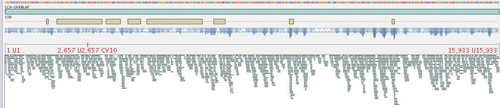

.. _blast2lca:

Profile a Community with BLAST
==============================

.. highlight:: bash
   :linenothreshold: 3

.. blockdiag::

	{
		default_fontsize=14;
    	default_textcolor = 'white';
    	node_width = 120;
    	node_height = 60;

    	class mgkit [color = "#e41a1c"];
	    class data [color = "#4daf4a"];
	    class software [color = "#377eb8"];
	    class gff [color = "#984ea3"];
    	class link-label [textcolor='black'];

		BLAST [label="BLAST+", class=software];
		blast2gff, filter, addtaxa, profile [class=mgkit];
		filter [label="GFF filter"];
		addtaxa [label="Add Taxonomy"];
		profile [label="Taxonomy\nProfile (LCA)"]

		BLAST -> blast2gff -> filter -> addtaxa -> profile;

		filter -> addtaxa [folded];
	}

The above diagram shows the process of getting a community profile from a BLAST run against a DB of choice. The choice of DB is up to the user, but any DB that provides a NCBI *taxon_id* can be used. Such DBs include the ones provided by NCBI (e.g. nt, nr, viral) as well as Uniprot (SwissProt, TrEMBL).

The community profile will use an assembly and we want to assign each of its contigs to taxon. This can be done a BLAST output and a series of scripts that ends with the *lca* command of the *taxon_utils* script (:ref:`taxon-utils`). *lca* stands for *last common ancestor*, which indicates that given a number of taxa, we try to resolve the taxon they all have in common. This can be of any level, from a specific strain to a kingdom, such as Bacteria.

There a cases when there's no *lca* that can be resolved and this is due to the way NCBI taxonomy is structured, with multiple top levels, such as *cellular organisms*, *viruses* and so on.

.. note::

	Other DB may provide the *taxon_id* from NCBI, but this should be checked by the user

Considerations
--------------

Since the assembly of a metagenome is a time consuming process, the assembly from the :ref:`hmmer-tutorial` tutorial will be used. We'll try to use all results from the *nt* DB from NCBI, as well as separate *viruses* and *cellular organisms* and resolve the *lca* for those annotations separately.

Another thing to consider is how to filter the annotations. That's up to the user to decide which suits the specific task, but these options will be examined:

	#. filter based on a static threshold, such as > 50 bitscore (using *filter-gff values*)
	#. filter based on a dynamically chosen value, keeping only the X top options (using *filter-gff sequence*)
	#. filter based on overlap (using *filter-gff overlap*)

The results may differ, and they are listed from the fastest to the slowest.

Requirements
------------

MGKit should be installed and its scripts can be run from the command line. Refer to the installation for this, but it's assumed that it was installed with::

	$ pip install mgkit[full]

Moreover, the tutorial makes use of UNIX command line utilities, so a version of GNU/Linux, *BSD or MacOS X should be used to run this tutorial. *BASH* is expected to be the shell running.

The following should be installed as well:

	* BLAST+ (blastn will be used)
	* ncftp (used to download the *NCBI nt* DB)

MacOS X
*******

The software requirements can be installed with *homebrew*, using the following command::

	$ brew install ncftp blast

Download Data
-------------

Assembly
********

TODO

NCBI nt
*******

We'll be using the NCBI nt which will be stored in the *ncbi-nt* directory. If a copy is already somewhere, just create a symbolic link to that directory, for example::

	$ ln -s path-to-the-db ncbi-nt

Otherwise, a copy can be downloaded and prepared with the following commands::

	$ mkdir ncbi-nt
	cd ncbi-nt
	ncftpget ftp://ftp.ncbi.nlm.nih.gov/blast/db/nt*.gz
	for x in *.tar.gz; do tar xfvz $x ;done
	rm *.tar.gz
	cd ..

ID to Taxonomy
**************

The following file contains the *taxon_id* for all the IDs in the *NCBI nt* DB. It will be used to add taxonomic information before running the *lca* step::

	$ wget ftp://ftp.ncbi.nih.gov/pub/taxonomy/accession2taxid/nucl_gb.accession2taxid.gz

NCBI Taxonomy
*************

This can be installed using the following script included in MGKit::

	$ download-taxonomy.sh

Which will create a file called *taxonomy.pickle*

Community Profiling
-------------------

To make the tutorial faster, we'll filter the assembly file to include only contigs of at least 500bp::

	$ python - <<END
	from mgkit.io import fasta
	with open('final-contigs-filt.fa', 'w') as f:
	    for name, seq in fasta.load_fasta('final-contigs.fa'):
	        if len(seq) >= 500:
	            fasta.write_fasta_sequence(f, name, seq)
	END

BLAST
*****

The *blastn* command will be used to search for similar sequences in the *NCBI nt* DB. The following command will create a tab separated file with the results::

	$ blastn -query final-contigs-filt.fa -db ncbi-nt/nt -outfmt 6 -out assembly-nt.tab -evalue 0.001

Convert into a GFF
******************

The following command will create a GFF file from the BLAST output::

	$ blast2gff blastdb -i 3 -r assembly-nt.tab assembly-nt.gff

We're using the *blastdb* command of the *blast2gff* command, since it gives more control over the way the header file is formatted::

	gi|118501159|gb|CP000482.1|

At the moment, the header format of the *NCBI nt* DB is a *|* (pipe) list that contains two type of identifiers. The first element is *gi*, to indicate that the following element (second) is the GI identifier that it's being retired in September 2016. The third is indicates the DB from where the other ID originates from (GenBank in this case) and the fourth is the identifier that we'll use.

 By default *blast2gff blastdb* used the second element (`118501159`) of the header as *gene_id*, so we use:

 	#. `-i 3` to instead use the fourth element (`CP000482.1`) as *gene_id*
 	#. `-r` will remove the versioning information from the *gene_id*, so `CP000482.1` will become `CP000482`

The reason for this is that the file containing the *taxon_id* for each identifier is better used with a fourth element of the header without the versioning information.

Adding the Taxonomic Information
********************************

The *add-gff-info addtaxa* command allows to insert taxonomic information (in the GFF *taxon_id* attribute) into the GFF file. This step integrates the content of the *nucl_gb.accession2taxid.gz* file with the GFF file. The structure of this file is:

	ACCESSION ACCESSION.VERSION TAXONID GI

.. warning::

	this command has to load all the GFF in memory, so a high memory machine should be used (~30GB). The GFF can be split into smaller files to save memory and the subsection here will describe the process.

Since we used the `ACCESSION` as *gene_id*, we need to edit the file to pass it to the *add-gff-info addtaxa* command `-t` option. This can be don on the fly and the following command adds information to the GFF file created::

	$ add-gff-info addtaxa -t <(gunzip -c nucl_gb.accession2taxid.gz | cut -f 1,3) -e assembly-nt.gff assembly-nt-taxa.gff; mv assembly-nt-taxa.gff assembly-nt.gff

The `-t` option is the file that can contains the *taxon_id* for each *gene_id*, the script accept a tab separated file. After the this we rename the output file to keep less files around. The `-e` option was used to remove from the output file any annotation for which a *taxon_id* was not found. Since we need them for the LCA later, it makes sense to remove them before filtering.

Reduce Memory Usage
###################

First we need to split the *assembly-nt.gff* file, with a good option being using the `split` command in Unix. The following command will create the files::

	$ split -l 1000000 -d assembly-nt.gff split-gff

This command will create 12 GFF files (of at most 1 milion lines each), whose names start with *split-gff*. Since we split the files we can use a loop to add the taxonomic information to all of them::

	$ for x in split-gff*; do
	add-gff-info addtaxa -t <(gunzip -c nucl_gb.accession2taxid.gz | cut -f 1,3) -e $x $x-taxa;
	done

This reduces the memory usage to ~2.5GB, but it takes longer to re-read the *nucl_gb.accession2taxid.gz* 12 times. There are way to parallelise it, but they are beyond the scope of this tutorial.

After the command has finished running, the content of the files can be concatenated into a single file again and delete the split files::

	$ cat split-gff*-taxa > assembly-nt.gff; rm split-gff*

Filter the GFF
**************

As mentioned we'll provide three different way to filter a GFF, before passing it to the script that will output the *lca* information. This way we can compare the different filtering strategies.

Filter by Value
###############

Let's assume a scenario where we're working on reads or very short contigs. We may decide to use a threshold, so the filtering is fast, but doesn't compromise the quality of the assignment. This can achieved using the *filter-gff values* command::

	$ filter-gff values -b 50 assembly-nt.gff assembly-nt_filt-value.gff

The command will read the GFF file and keep only the hits that are greater than or equal to 50, which we're assuming is a good compromise for the assignment. This filtering strategy has the advantage of operating on a per-annotation basis, so the memory usage is low and no grouping or calculation is required.

Filter Dynamically
##################

While the above can be give good results, we can think of cases where the number of hits that pass that threshold may be high (e.g. a conserved sequence in multiple organisms). In this case a more sensible choice would be to keep only the hits that are in the top 5-10% of the hits on that contig, all those over the median, mean or any other threshold based on the distribution of a sequence's hits. The *filter-gff sequence* command can be used to filter the GFF::

	$ filter-gff sequence -t -q .95 -c ge assembly-nt.gff assembly-nt_filt-sequence.gff

The options used will keep only the hits that have a bitscore (evalue and identity can also be used) greater than or equal to the top 5% of the bitscore distribution for that contig.

This threshold will include also contigs that have only one hit (that's the reason to use `-c ge` instead of `-c gt`). We also assume that the input GFF is sorted (`-t` option) by contig name, to use less memory.

Filter Ovelaps
##############

Let's assume that in some cases the we think there may be cases where the contig contains regions that different rates of conservation. The first filter may keep too many taxa with similar sequences in a portion of the contig, while the second one may not provide enough coverage of the contig, keeping only the very best hits.

In this case, we can use the *filter-gff overlap* command to keep of all overlapping hits only the best one. And since we want to make sure that we still have good homology, we could still filter by value the hits, before that filter.

The following command will make that type of filtering::

	$ filter-gff values -b 50 assembly-nt.gff | sort -s -k 1,1 -k 7,7 | filter-gff overlap -t -s 1 - assembly-nt_filt-overlap.gff

We just chained the filtering from the *values* command, keeping only annotations with at least 50 bitscore and passing it to the sort command. This passage is not necessary it the the `-t` option is not used with *filter-gff overlap*, but it uses less memory by pre-sorting the GFF by contig/strand first, since the *filter-gff overlap* works on each strand separately. We also used the `-s` options to trigger the filter for annotations that overlap for as much as 1 bp.

More information about this type of filter can be found in :ref:`simple-tutorial` and :ref:`filter-gff`.

Getting the Profile
*******************

We'll have 3 GFF files ending in *final.gff*, one per each type of filtering, that contain the *taxon_id* for each annotation they contain.

.. note::

	these files are available at `this page <http://bitbucket.org>`_ if you want to skip

Since the filtered files are available now, we can create a file that contains the LCA assignments. We can ouput 2 type of files (see :ref:`taxon-utils`), but for the purpose of this tutorial, we'll get a GFF file that we can also use in a assembly viewer. The command to create them is::

	$ for x in *filt-*.gff; do
	taxon_utils lca -v -t taxonomy.pickle -r final-contigs-filt.fa -s -n `basename $x .gff`-nolca.tab -ft LCA-`echo $x | egrep -o 'value|overlap|sequence' | tr [:lower:] [:upper:]` $x `basename $x .gff`-lca.gff;
	done

The options used are:

	* `-t` to direct the script to the taxonomy that we already downloaded
	* `-r` to output a GFF with one annotation per contig that covers the whole sequence
	* `-s` indicates that the input is sorted by reference sequence
	* `-n` outputs a tab separated file with the contigs that could not be assigned
	* `-ft` is used to change the *feature type* column in the GFF, from the dafault *LCA* to one which includes the type of filtering used

The file ending in *-nolca.tab* contain the contigs that could not be assigned, while the files ending in *-lca.gff* contain the taxonomic assignments, with the *taxon_id* pointing to the assigned taxon identifier, *taxon_name* for the taxon scientific name (or common name if none is found) and *lineage* contains the whole lineage of the taxon.

Using Krona
###########

Besides having a file with the assignments and a GFF that can be used in Tablet, a quick profile can be produced using `Krona <https://github.com/marbl/Krona/wiki>`_ and its associated *Krona Tools*. To produce a file that can be used with Krona Tools the **-k** can be used with the *taxon_utils lca* command. An additional option is to give the tool the total number of sequences in the assembly with the **-kt** option, to have a complete profile of the assembly::

	$ for x in *filt-{overlap,sequence,value}.gff; do
	taxon_utils lca -v -t taxonomy.pickle -k -kt `grep -c '>' final-contigs-filt.fa` -s $x `basename $x .gff`-lca.krona;
	done

To the *-kt* option was passed the total number of sequences (just used grep to count how many headers are in the fasta file).

The produced files with **krona** extension can be the be used with the **ktImportText** (or **ImportText** if Krona Tools were not installed). The **-q** option of the script must be used::

	$ for x in *.krona; do
	ktImportText -q -o `basename $x .krona`.html $x;
	done

This will create an HTML file for each one that can be read in a web browser.

Using Tablet
############

The GFF created can be used in software such as `Tablet <https://ics.hutton.ac.uk/tablet/>`_. The image below shows a contig with the features loaded from the filtered (overlap) GFF and the GFF LCA file produced by *taxon_utils lca*.

