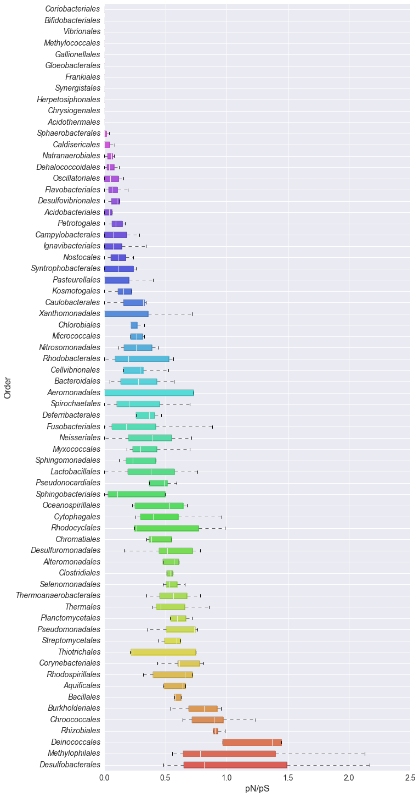
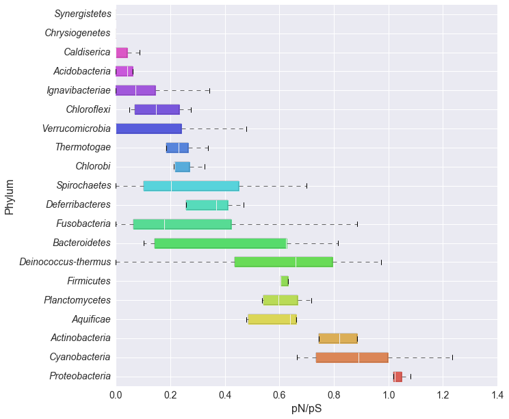
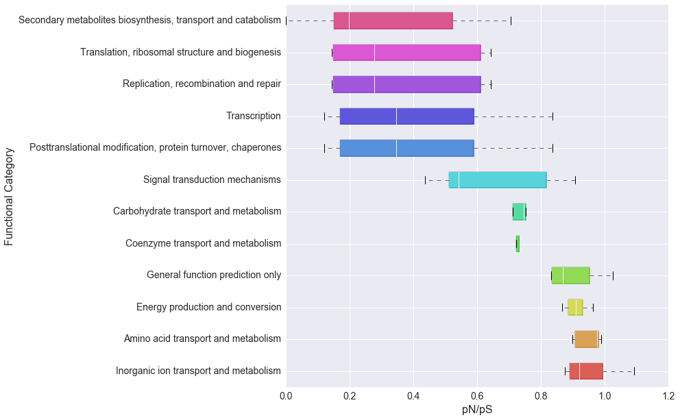
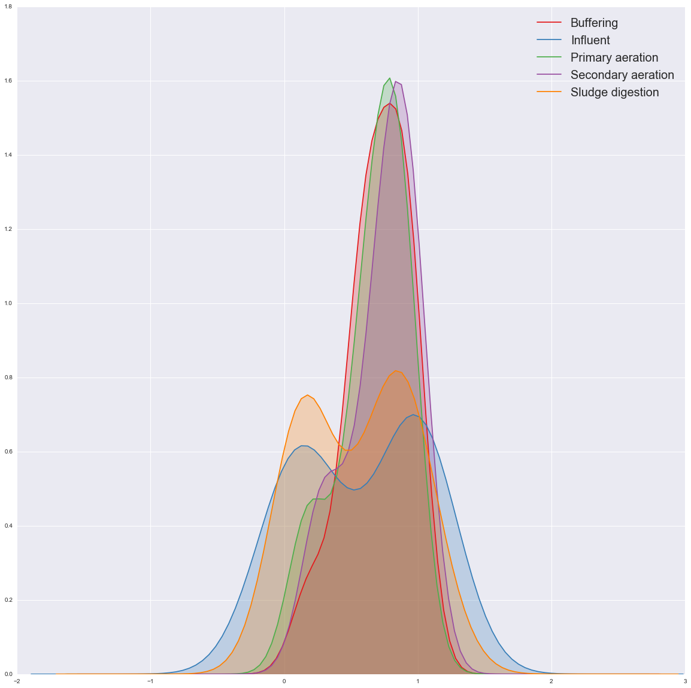
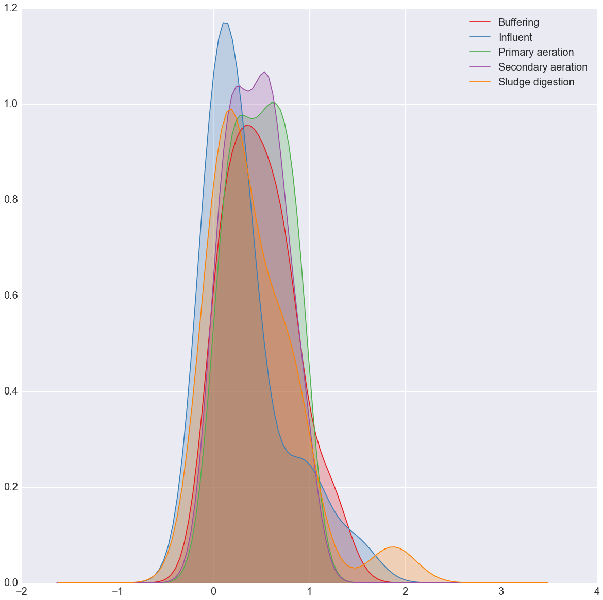
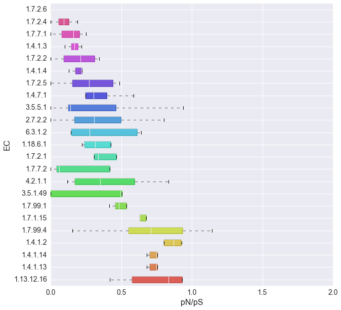
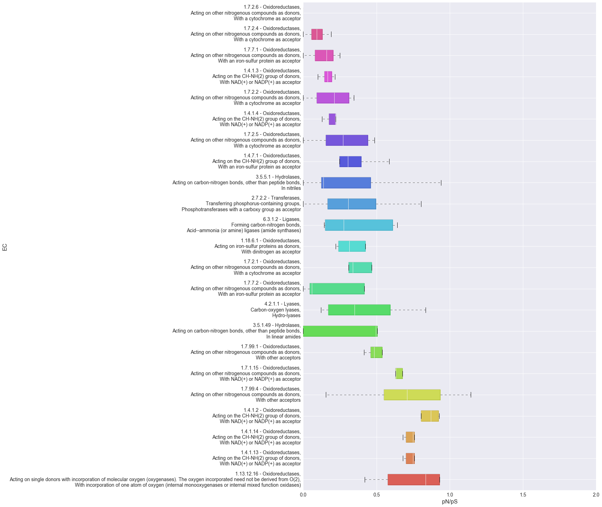
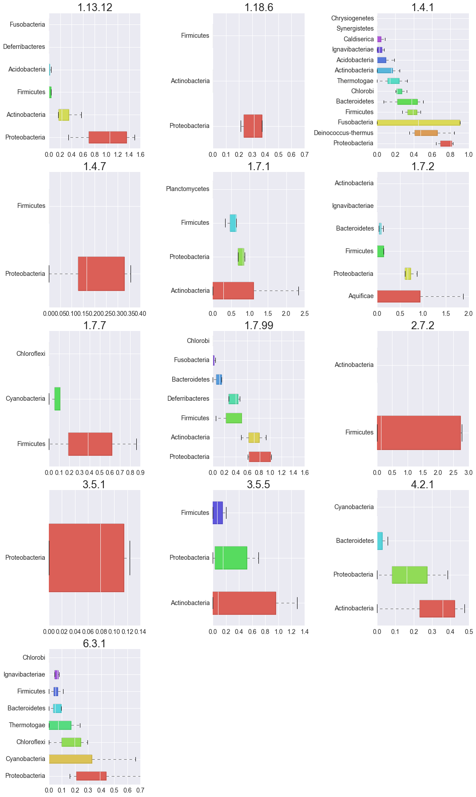

HMMER Tutorial - Exploring the Data
===================================

The HMMER tutorial should be completed or a copy of the data downloaded
(`figshare <http://files.figshare.com/2599149/tutorial_hmmer_data.zip>`__)
and uncompressed. The followind variable can be used to change the
default location.

.. code:: ipython2

    # Directory where the tutorial data is found
    data_dir = 'tutorial-hmmer-data/'

Imports
-------

.. code:: ipython2

    from __future__ import print_function
    
    #Python Standard Library
    import glob
    import pickle
    import sys
    import itertools
    
    #External Dependencies (install via pip or anaconda)
    
    # Check if running interactively or not
    import matplotlib as mpl # http://matplotlib.org
    # from:
    # http://stackoverflow.com/questions/15411967/how-can-i-check-if-code-is-executed-in-the-ipython-notebook
    # and
    # http://stackoverflow.com/questions/15455029/python-matplotlib-agg-vs-interactive-plotting-and-tight-layout
    import __main__ as main
    if hasattr(main, '__file__'):
        # Non interactive, force the use of Agg backend instead
        # of the default one
        mpl.use('Agg')
    
    import numpy # http://www.numpy.org
    import pandas # http://pandas.pydata.org
    import seaborn # http://stanford.edu/~mwaskom/software/seaborn/
    import scipy # http://www.scipy.org
    import matplotlib.pyplot as plt 
    
    
    #MGKit Import
    from mgkit.io import gff, fasta
    from mgkit.mappings import eggnog
    import mgkit.counts, mgkit.taxon, mgkit.snps, mgkit.plots
    import mgkit.snps
    import mgkit.mappings.enzyme
    import mgkit.net.uniprot
    import mgkit.utils.dictionary
    import mgkit.kegg

.. parsed-literal::

    /Users/francesco/dev/dev-env/lib/python2.7/site-packages/matplotlib/__init__.py:872: UserWarning: axes.color_cycle is deprecated and replaced with axes.prop_cycle; please use the latter.
      warnings.warn(self.msg_depr % (key, alt_key))

.. code:: ipython2

    mgkit.logger.config_log()

.. code:: ipython2

    mgkit.cite(sys.stdout)

.. parsed-literal::

    
     _|      _|    _|_|_|  _|    _|  _|    _|
     _|_|  _|_|  _|        _|  _|        _|_|_|_|
     _|  _|  _|  _|  _|_|  _|_|      _|    _|
     _|      _|  _|    _|  _|  _|    _|    _|
     _|      _|    _|_|_|  _|    _|  _|      _|_|
    
    
    MGKit Version: 0.2.1
    
    Rubino, F. and Creevey, C.J. (2014).
    MGkit: Metagenomic Framework For The Study Of Microbial Communities.
    
    Available at: http://figshare.com/articles/MGkit_Metagenomic_Framework_For_The_Study_Of_Microbial_Communities/1269288
    
    [doi:10.6084/m9.figshare.1269288]
    

Reads Data
----------

.. code:: ipython2

    # This file contains the SNPs information and it is the output
    # of the snp_parser script
    snp_data = pickle.load(open('{}snp_data.pickle'.format(data_dir), 'r'))

.. code:: ipython2

    # Taxonomy needs to be download beforehand. It is loaded into an an
    # instance of mgkit.taxon.UniprotTaxonomy. It is used in filtering
    # data and to map taxon IDs to different levels in the taxonomy
    taxonomy = mgkit.taxon.UniprotTaxonomy('{}mg_data/taxonomy.pickle'.format(data_dir))

.. parsed-literal::

    INFO:mgkit.taxon:Loading taxonomy from file tutorial-hmmer-data/mg_data/taxonomy.pickle
    2015-12-04 14:08:38,059 -    INFO - mgkit.taxon->load_data: Loading taxonomy from file tutorial-hmmer-data/mg_data/taxonomy.pickle

.. code:: ipython2

    # Loads all annotations in a dictionary, with the unique ID (uid) as key
    # and the mgkit.io.gff.Annotation instance that represent the line in the
    # GFF file as value
    annotations = {x.uid: x for x in gff.parse_gff('{}assembly.filt.cov.gff'.format(data_dir))}

.. parsed-literal::

    INFO:mgkit.io.gff:Loading GFF from file (tutorial-hmmer-data/assembly.filt.cov.gff)
    2015-12-04 14:10:30,369 -    INFO - mgkit.io.gff->parse_gff: Loading GFF from file (tutorial-hmmer-data/assembly.filt.cov.gff)

.. code:: ipython2

    # Sample names
    sample_names = {
        'I': "Influent",
        'B': "Buffering",
        'SA': "Secondary aeration",
        'PA': "Primary aeration",
        'SD': "Sludge digestion",
    }

Explore Taxa Diversity
----------------------

Diversity in metagenomic samples can be analysed using pN/pS values. The
data required to do this was produced in the tutorial by the
*snp\_parser* script. Here are some examples of how to calculate
diversity estimates from this data.

The complete toolset to map diversity estimates can be found in the
**mgkit.snps** package, with the
*mgkit.snps.funcs.combine\_sample\_snps* function building the final
pandas DataFrame. As the use of the function requires the initialisation
of different functions, a few easier to use ones are available in the
**mgkit.snps.conv\_func** module:

-  get\_rank\_dataframe
-  get\_gene\_map\_dataframe
-  get\_full\_dataframe
-  get\_gene\_taxon\_dataframe

The first is used to get diversity estimates for taxa, the second for
genes/functions. The other two provides functionality to return
estimates tied to both taxon and function.

.. code:: ipython2

    # Sets the minimum coverage for an annotation to be
    # included into the table (defaults to 4)
    mgkit.consts.DEFAULT_SNP_FILTER['min_cov'] = 4

.. code:: ipython2

    # To get diversity estimates for taxa *mgkit.snps.conv_func.get_rank_dataframe* can be used
    # It is also imported and accesible from the *mgkit.snps* package
    # ATTENTION: the lowest rank that can be used is *order*, since that's the level that was
    # used when the profiles were created
    pnps = mgkit.snps.get_rank_dataframe(snp_data, taxonomy, min_num=3, rank='order', index_type='taxon')

.. parsed-literal::

    INFO:mgkit.snps.funcs:Analysing SNP from sample I
    2015-12-04 14:10:30,781 -    INFO - mgkit.snps.funcs->combine_sample_snps: Analysing SNP from sample I
    INFO:mgkit.snps.funcs:Analysing SNP from sample SA
    2015-12-04 14:10:31,072 -    INFO - mgkit.snps.funcs->combine_sample_snps: Analysing SNP from sample SA
    INFO:mgkit.snps.funcs:Analysing SNP from sample B
    2015-12-04 14:10:31,168 -    INFO - mgkit.snps.funcs->combine_sample_snps: Analysing SNP from sample B
    INFO:mgkit.snps.funcs:Analysing SNP from sample PA
    2015-12-04 14:10:31,393 -    INFO - mgkit.snps.funcs->combine_sample_snps: Analysing SNP from sample PA
    INFO:mgkit.snps.funcs:Analysing SNP from sample SD
    2015-12-04 14:10:31,662 -    INFO - mgkit.snps.funcs->combine_sample_snps: Analysing SNP from sample SD

.. code:: ipython2

    # Renaming the columns and rows
    pnps = pnps.rename(
        columns=sample_names,
        index=lambda x: taxonomy[x].s_name.capitalize()
    )

.. code:: ipython2

    # The dataframe exposes a method that print a table with some basic statistics
    pnps.describe()

.. raw:: html

    

    <table border="1" class="dataframe">
      <thead>
        <tr style="text-align: right;">
          <th></th>
          <th>Buffering</th>
          <th>Influent</th>
          <th>Primary aeration</th>
          <th>Secondary aeration</th>
          <th>Sludge digestion</th>
        </tr>
      </thead>
      <tbody>
        <tr>
          <th>count</th>
          <td>60.000000</td>
          <td>55.000000</td>
          <td>60.000000</td>
          <td>53.000000</td>
          <td>48.000000</td>
        </tr>
        <tr>
          <th>mean</th>
          <td>0.439053</td>
          <td>0.368924</td>
          <td>0.434174</td>
          <td>0.300415</td>
          <td>0.277117</td>
        </tr>
        <tr>
          <th>std</th>
          <td>0.421404</td>
          <td>0.421266</td>
          <td>0.348828</td>
          <td>0.340843</td>
          <td>0.463352</td>
        </tr>
        <tr>
          <th>min</th>
          <td>0.000000</td>
          <td>0.000000</td>
          <td>0.000000</td>
          <td>0.000000</td>
          <td>0.000000</td>
        </tr>
        <tr>
          <th>25%</th>
          <td>0.120212</td>
          <td>0.000000</td>
          <td>0.156754</td>
          <td>0.000000</td>
          <td>0.000000</td>
        </tr>
        <tr>
          <th>50%</th>
          <td>0.377335</td>
          <td>0.167667</td>
          <td>0.389669</td>
          <td>0.200464</td>
          <td>0.096411</td>
        </tr>
        <tr>
          <th>75%</th>
          <td>0.652356</td>
          <td>0.588091</td>
          <td>0.703563</td>
          <td>0.509091</td>
          <td>0.340973</td>
        </tr>
        <tr>
          <th>max</th>
          <td>2.168022</td>
          <td>1.481172</td>
          <td>1.448138</td>
          <td>1.447522</td>
          <td>2.130008</td>
        </tr>
      </tbody>
    </table>
    

.. code:: ipython2

    # The complete table
    pnps

.. raw:: html

    

    <table border="1" class="dataframe">
      <thead>
        <tr style="text-align: right;">
          <th></th>
          <th>Buffering</th>
          <th>Influent</th>
          <th>Primary aeration</th>
          <th>Secondary aeration</th>
          <th>Sludge digestion</th>
        </tr>
      </thead>
      <tbody>
        <tr>
          <th>Coriobacteriales</th>
          <td>0.000000</td>
          <td>0.000000</td>
          <td>NaN</td>
          <td>0.000000</td>
          <td>0.000000</td>
        </tr>
        <tr>
          <th>Sphaerobacterales</th>
          <td>0.000000</td>
          <td>0.040271</td>
          <td>0.000000</td>
          <td>NaN</td>
          <td>NaN</td>
        </tr>
        <tr>
          <th>Bifidobacteriales</th>
          <td>0.000000</td>
          <td>0.000000</td>
          <td>0.000000</td>
          <td>0.000000</td>
          <td>0.000000</td>
        </tr>
        <tr>
          <th>Micrococcales</th>
          <td>0.325792</td>
          <td>NaN</td>
          <td>0.216755</td>
          <td>0.213321</td>
          <td>0.310000</td>
        </tr>
        <tr>
          <th>Corynebacteriales</th>
          <td>0.779613</td>
          <td>0.598788</td>
          <td>0.813224</td>
          <td>0.614930</td>
          <td>0.436968</td>
        </tr>
        <tr>
          <th>Pseudonocardiales</th>
          <td>0.491324</td>
          <td>0.000000</td>
          <td>0.590002</td>
          <td>0.487183</td>
          <td>NaN</td>
        </tr>
        <tr>
          <th>Streptomycetales</th>
          <td>0.490956</td>
          <td>1.022727</td>
          <td>0.437736</td>
          <td>0.622101</td>
          <td>0.592287</td>
        </tr>
        <tr>
          <th>Frankiales</th>
          <td>NaN</td>
          <td>0.000000</td>
          <td>0.000000</td>
          <td>0.000000</td>
          <td>0.000000</td>
        </tr>
        <tr>
          <th>Myxococcales</th>
          <td>0.249625</td>
          <td>NaN</td>
          <td>0.185956</td>
          <td>0.698357</td>
          <td>0.338927</td>
        </tr>
        <tr>
          <th>Synergistales</th>
          <td>NaN</td>
          <td>0.000000</td>
          <td>NaN</td>
          <td>0.000000</td>
          <td>0.000000</td>
        </tr>
        <tr>
          <th>Rhodocyclales</th>
          <td>0.770200</td>
          <td>0.266041</td>
          <td>0.986931</td>
          <td>0.247618</td>
          <td>0.245071</td>
        </tr>
        <tr>
          <th>Thiotrichales</th>
          <td>1.769663</td>
          <td>0.212865</td>
          <td>0.747395</td>
          <td>0.232536</td>
          <td>0.221519</td>
        </tr>
        <tr>
          <th>Pseudomonadales</th>
          <td>0.352748</td>
          <td>0.746125</td>
          <td>0.733799</td>
          <td>0.504313</td>
          <td>0.760380</td>
        </tr>
        <tr>
          <th>Methylophilales</th>
          <td>0.557626</td>
          <td>1.400000</td>
          <td>0.644354</td>
          <td>0.784722</td>
          <td>2.130008</td>
        </tr>
        <tr>
          <th>Neisseriales</th>
          <td>0.713064</td>
          <td>0.000000</td>
          <td>0.390926</td>
          <td>NaN</td>
          <td>NaN</td>
        </tr>
        <tr>
          <th>Chroococcales</th>
          <td>0.639959</td>
          <td>1.238286</td>
          <td>0.716351</td>
          <td>0.971297</td>
          <td>0.895644</td>
        </tr>
        <tr>
          <th>Ignavibacteriales</th>
          <td>0.144020</td>
          <td>0.000000</td>
          <td>0.342028</td>
          <td>0.073338</td>
          <td>0.000000</td>
        </tr>
        <tr>
          <th>Selenomonadales</th>
          <td>0.533700</td>
          <td>0.657085</td>
          <td>0.477703</td>
          <td>NaN</td>
          <td>NaN</td>
        </tr>
        <tr>
          <th>Planctomycetales</th>
          <td>0.649952</td>
          <td>0.717914</td>
          <td>0.541085</td>
          <td>0.537579</td>
          <td>NaN</td>
        </tr>
        <tr>
          <th>Desulfovibrionales</th>
          <td>0.126072</td>
          <td>NaN</td>
          <td>0.127016</td>
          <td>0.078766</td>
          <td>0.000000</td>
        </tr>
        <tr>
          <th>Desulfobacterales</th>
          <td>2.168022</td>
          <td>0.485765</td>
          <td>0.817073</td>
          <td>NaN</td>
          <td>NaN</td>
        </tr>
        <tr>
          <th>Spirochaetales</th>
          <td>0.203711</td>
          <td>NaN</td>
          <td>0.699301</td>
          <td>NaN</td>
          <td>0.000000</td>
        </tr>
        <tr>
          <th>Nostocales</th>
          <td>NaN</td>
          <td>0.110139</td>
          <td>NaN</td>
          <td>0.237636</td>
          <td>0.000000</td>
        </tr>
        <tr>
          <th>Acidobacteriales</th>
          <td>0.000000</td>
          <td>0.042027</td>
          <td>0.325988</td>
          <td>0.061913</td>
          <td>0.000000</td>
        </tr>
        <tr>
          <th>Rhodospirillales</th>
          <td>0.659567</td>
          <td>1.469901</td>
          <td>0.721659</td>
          <td>0.316433</td>
          <td>0.398420</td>
        </tr>
        <tr>
          <th>Acidothermales</th>
          <td>0.000000</td>
          <td>NaN</td>
          <td>0.000000</td>
          <td>0.000000</td>
          <td>NaN</td>
        </tr>
        <tr>
          <th>Rhodobacterales</th>
          <td>0.089243</td>
          <td>0.530612</td>
          <td>0.564000</td>
          <td>0.000000</td>
          <td>0.196405</td>
        </tr>
        <tr>
          <th>Sphingomonadales</th>
          <td>0.887931</td>
          <td>0.123383</td>
          <td>0.266409</td>
          <td>0.200464</td>
          <td>NaN</td>
        </tr>
        <tr>
          <th>Caulobacterales</th>
          <td>NaN</td>
          <td>0.338558</td>
          <td>NaN</td>
          <td>0.000000</td>
          <td>0.316310</td>
        </tr>
        <tr>
          <th>Thermoanaerobacterales</th>
          <td>0.563380</td>
          <td>0.344164</td>
          <td>0.786385</td>
          <td>NaN</td>
          <td>NaN</td>
        </tr>
        <tr>
          <th>...</th>
          <td>...</td>
          <td>...</td>
          <td>...</td>
          <td>...</td>
          <td>...</td>
        </tr>
        <tr>
          <th>Chrysiogenales</th>
          <td>NaN</td>
          <td>0.000000</td>
          <td>0.000000</td>
          <td>0.000000</td>
          <td>NaN</td>
        </tr>
        <tr>
          <th>Herpetosiphonales</th>
          <td>0.000000</td>
          <td>0.000000</td>
          <td>0.000000</td>
          <td>0.000000</td>
          <td>NaN</td>
        </tr>
        <tr>
          <th>Caldisericales</th>
          <td>0.000000</td>
          <td>0.086357</td>
          <td>0.000000</td>
          <td>NaN</td>
          <td>NaN</td>
        </tr>
        <tr>
          <th>Campylobacterales</th>
          <td>NaN</td>
          <td>0.151349</td>
          <td>0.287558</td>
          <td>0.000000</td>
          <td>0.000000</td>
        </tr>
        <tr>
          <th>Rhizobiales</th>
          <td>0.887484</td>
          <td>0.986436</td>
          <td>0.929422</td>
          <td>0.903979</td>
          <td>0.890299</td>
        </tr>
        <tr>
          <th>Bacillales</th>
          <td>0.629597</td>
          <td>0.577393</td>
          <td>0.574336</td>
          <td>0.026619</td>
          <td>2.098214</td>
        </tr>
        <tr>
          <th>Cellvibrionales</th>
          <td>0.293094</td>
          <td>0.524276</td>
          <td>0.320110</td>
          <td>0.157201</td>
          <td>0.158479</td>
        </tr>
        <tr>
          <th>Natranaerobiales</th>
          <td>0.080504</td>
          <td>0.000000</td>
          <td>NaN</td>
          <td>0.056889</td>
          <td>NaN</td>
        </tr>
        <tr>
          <th>Gloeobacterales</th>
          <td>0.000000</td>
          <td>NaN</td>
          <td>0.000000</td>
          <td>NaN</td>
          <td>0.000000</td>
        </tr>
        <tr>
          <th>Aquificales</th>
          <td>0.479208</td>
          <td>0.487144</td>
          <td>1.362804</td>
          <td>0.661458</td>
          <td>0.639444</td>
        </tr>
        <tr>
          <th>Deferribacterales</th>
          <td>0.345073</td>
          <td>NaN</td>
          <td>0.393624</td>
          <td>0.467729</td>
          <td>0.000000</td>
        </tr>
        <tr>
          <th>Gallionellales</th>
          <td>0.000000</td>
          <td>NaN</td>
          <td>0.000000</td>
          <td>0.000000</td>
          <td>0.000000</td>
        </tr>
        <tr>
          <th>Desulfuromonadales</th>
          <td>0.720199</td>
          <td>0.164019</td>
          <td>0.784496</td>
          <td>0.449230</td>
          <td>0.515495</td>
        </tr>
        <tr>
          <th>Kosmotogales</th>
          <td>0.146927</td>
          <td>0.397163</td>
          <td>0.166667</td>
          <td>NaN</td>
          <td>0.000000</td>
        </tr>
        <tr>
          <th>Petrotogales</th>
          <td>0.170068</td>
          <td>0.095607</td>
          <td>0.063415</td>
          <td>0.147296</td>
          <td>0.000000</td>
        </tr>
        <tr>
          <th>Clostridiales</th>
          <td>0.560006</td>
          <td>0.819355</td>
          <td>0.543821</td>
          <td>0.509091</td>
          <td>0.237484</td>
        </tr>
        <tr>
          <th>Chlorobiales</th>
          <td>0.216197</td>
          <td>NaN</td>
          <td>0.325508</td>
          <td>NaN</td>
          <td>0.213579</td>
        </tr>
        <tr>
          <th>Chromatiales</th>
          <td>0.368370</td>
          <td>0.385907</td>
          <td>0.550052</td>
          <td>0.959834</td>
          <td>0.347109</td>
        </tr>
        <tr>
          <th>Xanthomonadales</th>
          <td>NaN</td>
          <td>0.000000</td>
          <td>NaN</td>
          <td>0.715543</td>
          <td>0.000000</td>
        </tr>
        <tr>
          <th>Methylococcales</th>
          <td>0.000000</td>
          <td>0.000000</td>
          <td>0.000000</td>
          <td>NaN</td>
          <td>0.000000</td>
        </tr>
        <tr>
          <th>Oceanospirillales</th>
          <td>0.678218</td>
          <td>0.643599</td>
          <td>0.531844</td>
          <td>0.252951</td>
          <td>0.226619</td>
        </tr>
        <tr>
          <th>Flavobacteriales</th>
          <td>NaN</td>
          <td>0.000000</td>
          <td>0.194606</td>
          <td>0.078641</td>
          <td>0.049440</td>
        </tr>
        <tr>
          <th>Alteromonadales</th>
          <td>0.477941</td>
          <td>0.844451</td>
          <td>0.611111</td>
          <td>0.567511</td>
          <td>0.143382</td>
        </tr>
        <tr>
          <th>Vibrionales</th>
          <td>0.000000</td>
          <td>0.000000</td>
          <td>NaN</td>
          <td>0.000000</td>
          <td>NaN</td>
        </tr>
        <tr>
          <th>Aeromonadales</th>
          <td>0.730048</td>
          <td>0.000000</td>
          <td>0.731155</td>
          <td>0.000000</td>
          <td>0.000000</td>
        </tr>
        <tr>
          <th>Pasteurellales</th>
          <td>0.400760</td>
          <td>NaN</td>
          <td>0.000000</td>
          <td>NaN</td>
          <td>0.000000</td>
        </tr>
        <tr>
          <th>Lactobacillales</th>
          <td>0.763260</td>
          <td>NaN</td>
          <td>0.382429</td>
          <td>NaN</td>
          <td>0.000000</td>
        </tr>
        <tr>
          <th>Syntrophobacterales</th>
          <td>0.259709</td>
          <td>NaN</td>
          <td>0.228894</td>
          <td>0.000000</td>
          <td>0.000000</td>
        </tr>
        <tr>
          <th>Sphingobacteriales</th>
          <td>0.171193</td>
          <td>1.481172</td>
          <td>NaN</td>
          <td>0.000000</td>
          <td>0.044568</td>
        </tr>
        <tr>
          <th>Cytophagales</th>
          <td>0.487101</td>
          <td>0.957447</td>
          <td>0.312349</td>
          <td>0.250000</td>
          <td>NaN</td>
        </tr>
      </tbody>
    </table>
    
68 rows × 5 columns

    

.. code:: ipython2

    # sort the DataFrame to plot them by mean value
    # older versions of pandas have a *sort* method instead of a *sort_values*
    plot_order = pnps.mean(axis=1).sort_values(inplace=False, ascending=False).index
    
    # A matplotlib single figure (sizes are in inches) can be created via a function in mgkit
    fig, ax = mgkit.plots.get_single_figure(figsize=(10, 25))
    
    # This function uses the boxplot function in matplotlib, adding some easier to use functionality
    _ = mgkit.plots.boxplot.boxplot_dataframe(
        pnps,
        plot_order, 
        ax,
        # By default the function renders the boxplot vertical.
        box_vert=False,
        # some fonts settings, note the *rotation* key, it refers to the rotation of the 
        # labels for the taxa names. The default is vertical, as the boxplot order above
        fonts=dict(fontsize=14, rotation='horizontal'),
        # the colours are generated with hls color palette, for the number of rows in the
        # DataFrame
        data_colours={
            x: color
            for x, color in zip(plot_order, seaborn.color_palette('hls', len(pnps.index)))
        }
    )
    
    # Taxa names should be in italics
    for text in ax.get_yticklabels():
        text.set_fontstyle('italic')
    
    # It sets the axes labels
    _ = ax.set_xlabel('pN/pS', fontsize=16)
    _ = ax.set_ylabel('Order', fontsize=16)

Phylum Level Diversity
~~~~~~~~~~~~~~~~~~~~~~

Even if it was chosen the *Order* as rank for the profiles, a higher
level represantation can be obtained.

.. code:: ipython2

    # The only difference is the *rank* chosen and the size of the plot
    pnps = mgkit.snps.get_rank_dataframe(snp_data, taxonomy, min_num=3, rank='phylum', index_type='taxon')
    
    pnps = pnps.rename(
        columns=sample_names,
        index=lambda x: taxonomy[x].s_name.capitalize()
    )
    #sort the DataFrame to plot them by mean value
    plot_order = pnps.mean(axis=1).sort_values(inplace=False, ascending=False).index
    
    fig, ax = mgkit.plots.get_single_figure(figsize=(10, 10))
    _ = mgkit.plots.boxplot.boxplot_dataframe(
        pnps, 
        plot_order, 
        ax, 
        fonts=dict(fontsize=14, rotation='horizontal'),
        data_colours={
            x: color
            for x, color in zip(plot_order, seaborn.color_palette('hls', len(pnps.index)))
        },
        box_vert=False
    )
    _ = ax.set_xlabel('pN/pS', fontsize=16)
    _ = ax.set_ylabel('Phylum', fontsize=16)
    
    # Taxa names should be in italics
    for text in ax.get_yticklabels():
        text.set_fontstyle('italic')

.. parsed-literal::

    INFO:mgkit.snps.funcs:Analysing SNP from sample I
    2015-12-04 14:10:33,608 -    INFO - mgkit.snps.funcs->combine_sample_snps: Analysing SNP from sample I
    INFO:mgkit.snps.funcs:Analysing SNP from sample SA
    2015-12-04 14:10:34,748 -    INFO - mgkit.snps.funcs->combine_sample_snps: Analysing SNP from sample SA
    INFO:mgkit.snps.funcs:Analysing SNP from sample B
    2015-12-04 14:10:35,199 -    INFO - mgkit.snps.funcs->combine_sample_snps: Analysing SNP from sample B
    INFO:mgkit.snps.funcs:Analysing SNP from sample PA
    2015-12-04 14:10:36,434 -    INFO - mgkit.snps.funcs->combine_sample_snps: Analysing SNP from sample PA
    INFO:mgkit.snps.funcs:Analysing SNP from sample SD
    2015-12-04 14:10:38,027 -    INFO - mgkit.snps.funcs->combine_sample_snps: Analysing SNP from sample SD

Using eggNOG and Functional Categories
--------------------------------------

Loading eggNOG Data
~~~~~~~~~~~~~~~~~~~

.. code:: ipython2

    # This class allow the mapping of eggNOG identifiers to Functional Categories
    eg = eggnog.NOGInfo()
    # Just a few to speed up the analysis, but other can be used
    # Should have been downloaded by the full tutorial script
    eg.load_members('{}map_data/COG.members.txt.gz'.format(data_dir))
    eg.load_members('{}map_data/NOG.members.txt.gz'.format(data_dir))
    eg.load_funccat('{}map_data/COG.funccat.txt.gz'.format(data_dir))
    eg.load_funccat('{}map_data/NOG.funccat.txt.gz'.format(data_dir))

.. parsed-literal::

    INFO:mgkit.mappings.eggnog:Reading Members from tutorial-hmmer-data/map_data/COG.members.txt.gz
    2015-12-04 14:10:39,083 -    INFO - mgkit.mappings.eggnog->load_members: Reading Members from tutorial-hmmer-data/map_data/COG.members.txt.gz
    INFO:mgkit.mappings.eggnog:Reading Members from tutorial-hmmer-data/map_data/NOG.members.txt.gz
    2015-12-04 14:10:52,456 -    INFO - mgkit.mappings.eggnog->load_members: Reading Members from tutorial-hmmer-data/map_data/NOG.members.txt.gz
    INFO:mgkit.mappings.eggnog:Reading Functional Categories from tutorial-hmmer-data/map_data/COG.funccat.txt.gz
    2015-12-04 14:11:00,173 -    INFO - mgkit.mappings.eggnog->load_funccat: Reading Functional Categories from tutorial-hmmer-data/map_data/COG.funccat.txt.gz
    INFO:mgkit.mappings.eggnog:Reading Functional Categories from tutorial-hmmer-data/map_data/NOG.funccat.txt.gz
    2015-12-04 14:11:00,190 -    INFO - mgkit.mappings.eggnog->load_funccat: Reading Functional Categories from tutorial-hmmer-data/map_data/NOG.funccat.txt.gz

Download KO to eggNOG Mappings
~~~~~~~~~~~~~~~~~~~~~~~~~~~~~~

To use functional categories a mapping from KO identifiers to eggNOG
ones is needed. There's no direct path to get this, but one way is to
get the mappings from KO to Uniprot identifiers and the mappings from
the resulting Uniprot identifiers to eggNOG identifiers. In MGKit, the
*net* package contains modules to use network resources. In particular,
the *mgkit.net.uniprot* can be used to query Uniprot and also map
identifiers.

.. code:: ipython2

    # All gene_id properties of the annotations are put in a *set* to remove duplicates
    ko_up = mgkit.net.uniprot.get_mappings(
        {annotation.gene_id for annotation in annotations.itervalues()}, 
        db_from='KO_ID', db_to='ID'
    )
    # While a complex expression, the *set* generation involves the iteration of all values from
    # the *ko_up* dictionary to eliminate the duplicates
    up_eg = mgkit.net.uniprot.get_mappings(
        set(itertools.chain(*(values for values in ko_up.itervalues()))), 
        db_from='ID', db_to='EGGNOG_ID'
    )

After obtaining the two dictionaries in the correct order, a mapping
dictionary can be produced with the
*mgkit.utils.dictionary.combine\_dict* function. This will produce a
direct KO to eggNOG identifiers map.

.. code:: ipython2

    ko_eg_map = mgkit.utils.dictionary.combine_dict(ko_up, up_eg)

Since we now have the KO to eggNOG mapping, we can associate to each KO
identifier, the functional categories

.. code:: ipython2

    #Build mapping KO IDs -> eggNOG functional categories
    fc_map = {
        # notice that we use the *ko_eg_map*
        annotation.gene_id: eg.get_nogs_funccat(ko_eg_map[annotation.gene_id])
        for annotation in annotations.itervalues()
    }

Saving the Mappings
^^^^^^^^^^^^^^^^^^^

It is possible to store the mapping we saved in the GFF with the
following

.. code:: ipython2

    # This will add the mappings to the annotations
    for annotation in annotations.itervalues():
        annotation.set_mapping('eggnog', ko_eg_map[annotation.gene_id])

.. code:: ipython2

    # And they are now available
    annotations[annotations.keys()[0]].get_mapping('eggnog')

.. parsed-literal::

    ['COG1251',
     'ENOG4108IB8',
     'ENOG4107QS0',
     'ENOG4107QWN',
     'ENOG4107SJS',
     'COG0155',
     'ENOG4107RZH',
     'ENOG4107TEW',
     'ENOG4108JV3',
     'COG0446',
     'ENOG4108EQM',
     'ENOG4108I5Y',
     'ENOG4105WZK',
     'ENOG4108IFG',
     'COG2146',
     'ENOG4108IKH',
     'arCOG01070',
     'ENOG4107QZF',
     'ENOG4108IBF',
     'ENOG4108FJS']

.. code:: ipython2

    # The GFF file needs to be saved
    with open('{}assembly.filt.cov.eggnog.gff'.format(data_dir), 'w') as fh:
        for annotation in annotations.itervalues():
            annotation.to_file(fh)

.. code:: ipython2

    # You can notice that the *map_EGGNOG* attribute was added to disk
    print(open("{}assembly.filt.cov.eggnog.gff".format(data_dir)).readline())

.. parsed-literal::

    2cd7ed88-d785-4c29-bcfa-f09c87d572bd	HMMER	gene	12	794	3.2e-30	-	2	B_cov="6";I_cov="0";PA_cov="7";SA_cov="3";SD_cov="3";aa_from="212";aa_seq="KNNIEVIMGSAKFTAPGKLSVELNDGGTEEVEAADVILATGAQPMIIPGMEPDGEKVLEYSQAIMLENLPASAVIIGGGAIGCEFATVWSAYGVEVHIVEMLPHLMPTEDDEAANELQKAFAKRGVKVHAGSKVKSVTKTETGTEVLLEGEGGEEKLAADITLVAVGFRPNSKDLGLEELGVEMDRRGFVQVDDRMATNVKGLWAIGDVTGQLLLAHVASAQGIVCAENIAGVETITLDYTMMPRAVYSHPQVASFGYTEA";aa_to="472";bitscore="111.6";cov="14";db="CUSTOM";evalue="3.2e-30";exp_nonsyn="1748";exp_syn="601";frame="r2";gene_id="K00362";ko_description="nirB%3B nitrite reductase (NADH) large subunit %5BEC%3A1.7.1.15%5D";ko_pathway="ko00910";ko_pathway_names="Nitrogen metabolism";map_EGGNOG="COG1251%2CENOG4108IB8%2CENOG4107QS0%2CENOG4107QWN%2CENOG4107SJS%2CCOG0155%2CENOG4107RZH%2CENOG4107TEW%2CENOG4108JV3%2CCOG0446%2CENOG4108EQM%2CENOG4108I5Y%2CENOG4105WZK%2CENOG4108IFG%2CCOG2146%2CENOG4108IKH%2CarCOG01070%2CENOG4107QZF%2CENOG4108IBF%2CENOG4108FJS";name="K00362_186802_clostridiales-nr";reviewed="False";taxon_id="186802";taxon_name="clostridiales-nr";uid="00d0c67e-1d0d-423b-abb4-5fa808bc0bf9"
    

Create FC DataFrame
~~~~~~~~~~~~~~~~~~~

.. code:: ipython2

    # The creation of the DataFrame for a gene is straight forward, by using the KO to FC map
    eg_pnps = mgkit.snps.get_gene_map_dataframe(snp_data, taxonomy, min_num=3, gene_map=fc_map, index_type='gene')

.. parsed-literal::

    INFO:mgkit.snps.funcs:Analysing SNP from sample I
    2015-12-04 14:11:33,988 -    INFO - mgkit.snps.funcs->combine_sample_snps: Analysing SNP from sample I
    INFO:mgkit.snps.funcs:Analysing SNP from sample SA
    2015-12-04 14:11:36,751 -    INFO - mgkit.snps.funcs->combine_sample_snps: Analysing SNP from sample SA
    INFO:mgkit.snps.funcs:Analysing SNP from sample B
    2015-12-04 14:11:37,615 -    INFO - mgkit.snps.funcs->combine_sample_snps: Analysing SNP from sample B
    INFO:mgkit.snps.funcs:Analysing SNP from sample PA
    2015-12-04 14:11:40,101 -    INFO - mgkit.snps.funcs->combine_sample_snps: Analysing SNP from sample PA
    INFO:mgkit.snps.funcs:Analysing SNP from sample SD
    2015-12-04 14:11:43,275 -    INFO - mgkit.snps.funcs->combine_sample_snps: Analysing SNP from sample SD

.. code:: ipython2

    # Renames rows/columns
    eg_pnps = eg_pnps.rename(
        columns=sample_names,
        index=eggnog.EGGNOG_CAT
    )

.. code:: ipython2

    eg_pnps.describe()

.. raw:: html

    

    <table border="1" class="dataframe">
      <thead>
        <tr style="text-align: right;">
          <th></th>
          <th>Buffering</th>
          <th>Influent</th>
          <th>Primary aeration</th>
          <th>Secondary aeration</th>
          <th>Sludge digestion</th>
        </tr>
      </thead>
      <tbody>
        <tr>
          <th>count</th>
          <td>12.000000</td>
          <td>10.000000</td>
          <td>12.000000</td>
          <td>12.000000</td>
          <td>12.000000</td>
        </tr>
        <tr>
          <th>mean</th>
          <td>0.705455</td>
          <td>0.575509</td>
          <td>0.659429</td>
          <td>0.729560</td>
          <td>0.549985</td>
        </tr>
        <tr>
          <th>std</th>
          <td>0.226856</td>
          <td>0.462371</td>
          <td>0.252799</td>
          <td>0.251077</td>
          <td>0.387537</td>
        </tr>
        <tr>
          <th>min</th>
          <td>0.198203</td>
          <td>0.000000</td>
          <td>0.186021</td>
          <td>0.276498</td>
          <td>0.119653</td>
        </tr>
        <tr>
          <th>25%</th>
          <td>0.608175</td>
          <td>0.142835</td>
          <td>0.588696</td>
          <td>0.656642</td>
          <td>0.148360</td>
        </tr>
        <tr>
          <th>50%</th>
          <td>0.705418</td>
          <td>0.680306</td>
          <td>0.733818</td>
          <td>0.793950</td>
          <td>0.636897</td>
        </tr>
        <tr>
          <th>75%</th>
          <td>0.882954</td>
          <td>0.982550</td>
          <td>0.844552</td>
          <td>0.919806</td>
          <td>0.873286</td>
        </tr>
        <tr>
          <th>max</th>
          <td>0.979928</td>
          <td>1.092022</td>
          <td>0.907965</td>
          <td>0.992486</td>
          <td>1.122793</td>
        </tr>
      </tbody>
    </table>
    

.. code:: ipython2

    eg_pnps

.. raw:: html

    

    <table border="1" class="dataframe">
      <thead>
        <tr style="text-align: right;">
          <th></th>
          <th>Buffering</th>
          <th>Influent</th>
          <th>Primary aeration</th>
          <th>Secondary aeration</th>
          <th>Sludge digestion</th>
        </tr>
      </thead>
      <tbody>
        <tr>
          <th>Energy production and conversion</th>
          <td>0.930722</td>
          <td>0.962269</td>
          <td>0.884856</td>
          <td>0.908775</td>
          <td>0.865246</td>
        </tr>
        <tr>
          <th>Amino acid transport and metabolism</th>
          <td>0.979928</td>
          <td>0.989311</td>
          <td>0.907965</td>
          <td>0.975269</td>
          <td>0.897406</td>
        </tr>
        <tr>
          <th>Carbohydrate transport and metabolism</th>
          <td>0.710614</td>
          <td>0.040148</td>
          <td>0.744589</td>
          <td>0.752744</td>
          <td>1.122793</td>
        </tr>
        <tr>
          <th>Coenzyme transport and metabolism</th>
          <td>0.700223</td>
          <td>0.925447</td>
          <td>0.723048</td>
          <td>0.733340</td>
          <td>0.732289</td>
        </tr>
        <tr>
          <th>Transcription</th>
          <td>0.506365</td>
          <td>NaN</td>
          <td>0.186021</td>
          <td>0.835155</td>
          <td>0.119653</td>
        </tr>
        <tr>
          <th>Translation, ribosomal structure and biogenesis</th>
          <td>0.642112</td>
          <td>0.142835</td>
          <td>0.611148</td>
          <td>0.276498</td>
          <td>0.148360</td>
        </tr>
        <tr>
          <th>Replication, recombination and repair</th>
          <td>0.642112</td>
          <td>0.142835</td>
          <td>0.611148</td>
          <td>0.276498</td>
          <td>0.148360</td>
        </tr>
        <tr>
          <th>Posttranslational modification, protein turnover, chaperones</th>
          <td>0.506365</td>
          <td>NaN</td>
          <td>0.186021</td>
          <td>0.835155</td>
          <td>0.119653</td>
        </tr>
        <tr>
          <th>Secondary metabolites biosynthesis, transport and catabolism</th>
          <td>0.198203</td>
          <td>0.000000</td>
          <td>0.521338</td>
          <td>0.705336</td>
          <td>0.150254</td>
        </tr>
        <tr>
          <th>Inorganic ion transport and metabolism</th>
          <td>0.875120</td>
          <td>1.092022</td>
          <td>0.890054</td>
          <td>0.992486</td>
          <td>0.920110</td>
        </tr>
        <tr>
          <th>General function prediction only</th>
          <td>0.867243</td>
          <td>1.025059</td>
          <td>0.831117</td>
          <td>0.952901</td>
          <td>0.834193</td>
        </tr>
        <tr>
          <th>Signal transduction mechanisms</th>
          <td>0.906455</td>
          <td>0.435165</td>
          <td>0.815846</td>
          <td>0.510558</td>
          <td>0.541506</td>
        </tr>
      </tbody>
    </table>
    

Plot the Distributions
^^^^^^^^^^^^^^^^^^^^^^

.. code:: ipython2

    #sort the DataFrame to plot them by mean value
    plot_order = eg_pnps.mean(axis=1).sort_values(inplace=False, ascending=False).index
    
    fig, ax = mgkit.plots.get_single_figure(figsize=(10, 10))
    _ = mgkit.plots.boxplot.boxplot_dataframe(
        eg_pnps, 
        plot_order, 
        ax, 
        fonts=dict(fontsize=14, rotation='horizontal'),
        data_colours={
            x: color
            for x, color in zip(plot_order, seaborn.color_palette('hls', len(eg_pnps.index)))
        },
        box_vert=False
    )
    _ = ax.set_xlabel('pN/pS', fontsize=16)
    _ = ax.set_ylabel('Functional Category', fontsize=16)

Plot Distributions as KDE
^^^^^^^^^^^^^^^^^^^^^^^^^

Some better profiling can be found using the a KDE (Kernel Density
Estimation). Seaborn makes it easy to plot it and it is easy to see that
the Influent (first part) and Sludge digestion (last part) have a wider
distribution of diversity estimates.

.. code:: ipython2

    fig, ax = mgkit.plots.get_single_figure(figsize=(20, 20))
    
    seaborn.set(font_scale=2)
    
    for figid, (sample, color) in enumerate(zip(eg_pnps.columns, seaborn.color_palette('Set1', len(eg_pnps.columns)))):
        seaborn.kdeplot(eg_pnps[sample].dropna(), ax=ax, color=color, shade=True)

Using Enzyme Classification
---------------------------

The enzyme classification mappings can be retrieved directly from KO
identifiers using the Kegg REST API. MGKit provides a class that makes
this easy to do.

.. code:: ipython2

    # The first step is to instance the Kegg client class
    kclient = mgkit.kegg.KeggClientRest()

.. code:: ipython2

    # the *link_ids* is use to link any kind of identifiers within the Kegg DB. The first argument
    # of the method is the target, in our case *ec*, for the enzyme classification and the second
    # argument is the list of identifiers to map. To reduce the size of the query and because it would
    # be redundant anyway, we can use a set for all annotations gene_id attribute we have.
    ec_map = kclient.link_ids('ec', set(annotation.gene_id for annotation in annotations.itervalues()))

.. code:: ipython2

    # You can see that for each KO identifier, a list of enzyme identifiers is returned
    ec_map['K00260']

.. parsed-literal::

    ['1.4.1.2']

.. code:: ipython2

    ec_pnps = mgkit.snps.get_gene_map_dataframe(snp_data, taxonomy, min_num=3, gene_map=ec_map, index_type='gene')

.. parsed-literal::

    INFO:mgkit.snps.funcs:Analysing SNP from sample I
    2015-12-04 14:11:47,538 -    INFO - mgkit.snps.funcs->combine_sample_snps: Analysing SNP from sample I
    INFO:mgkit.snps.funcs:Analysing SNP from sample SA
    2015-12-04 14:11:47,663 -    INFO - mgkit.snps.funcs->combine_sample_snps: Analysing SNP from sample SA
    INFO:mgkit.snps.funcs:Analysing SNP from sample B
    2015-12-04 14:11:47,727 -    INFO - mgkit.snps.funcs->combine_sample_snps: Analysing SNP from sample B
    INFO:mgkit.snps.funcs:Analysing SNP from sample PA
    2015-12-04 14:11:47,899 -    INFO - mgkit.snps.funcs->combine_sample_snps: Analysing SNP from sample PA
    INFO:mgkit.snps.funcs:Analysing SNP from sample SD
    2015-12-04 14:11:48,116 -    INFO - mgkit.snps.funcs->combine_sample_snps: Analysing SNP from sample SD

.. code:: ipython2

    # The enzyme classification naming is verbose, so it's better not to rename the rows
    ec_pnps = ec_pnps.rename(columns=sample_names)

Distributions of EC
~~~~~~~~~~~~~~~~~~~

.. code:: ipython2

    fig, ax = mgkit.plots.get_single_figure(figsize=(20, 20))
    
    seaborn.set(font_scale=2)
    
    for figid, (sample, color) in enumerate(zip(ec_pnps.columns, seaborn.color_palette('Set1', len(ec_pnps.columns)))):
        seaborn.kdeplot(ec_pnps[sample].dropna(), ax=ax, color=color, shade=True)

.. code:: ipython2

    #sort the DataFrame to plot them by mean value
    plot_order = ec_pnps.mean(axis=1).sort_values(inplace=False, ascending=False).index
    
    fig, ax = mgkit.plots.get_single_figure(figsize=(10, 10))
    _ = mgkit.plots.boxplot.boxplot_dataframe(
        ec_pnps, 
        plot_order, 
        ax, 
        fonts=dict(fontsize=14, rotation='horizontal'),
        data_colours={
            x: color
            for x, color in zip(plot_order, seaborn.color_palette('hls', len(ec_pnps.index)))
        },
        box_vert=False
    )
    _ = ax.set_xlabel('pN/pS', fontsize=16)
    _ = ax.set_ylabel('EC', fontsize=16)

Adding full names to the enzymes
^^^^^^^^^^^^^^^^^^^^^^^^^^^^^^^^

A dictionary with EC names (enzclass.txt) must be collected from expasy,
at the following
`address <ftp://ftp.expasy.org/databases/enzyme/enzclass.txt>`__

.. code:: ipython2

    # The names of all EC identifiers can be obtained from expasy
    ec_names = mgkit.mappings.enzyme.parse_expasy_file("{}map_data/enzclass.txt".format(data_dir))

.. code:: ipython2

    reload(mgkit.mappings.enzyme)

.. parsed-literal::

    <module 'mgkit.mappings.enzyme' from '/Users/francesco/dev/mgkit/mgkit/mappings/enzyme.pyc'>

.. code:: ipython2

    #sort the DataFrame to plot them by mean value
    plot_order = ec_pnps.mean(axis=1).sort_values(inplace=False, ascending=False).index
    
    fig, ax = mgkit.plots.get_single_figure(figsize=(15, 25))
    _ = mgkit.plots.boxplot.boxplot_dataframe(
        ec_pnps, 
        plot_order,
        ax, 
        fonts=dict(fontsize=14, rotation='horizontal'),
        data_colours={
            x: color
            for x, color in zip(plot_order, seaborn.color_palette('hls', len(ec_pnps.index)))
        },
        box_vert=False,
        
        label_map={
            ec_id: "{} - {}".format(
                ec_id,
                mgkit.mappings.enzyme.get_enzyme_full_name(ec_id, ec_names, ',\n')
            )
            for ec_id in plot_order
        }
    )
    _ = ax.set_xlabel('pN/pS', fontsize=16)
    _ = ax.set_ylabel('EC', fontsize=16)

Using a Full Gene/Taxon DataFrame
---------------------------------

It possible to use data at the most specific level, by using the
**mgkit.snps.conv\_func.get\_full\_dataframe** function. This can be
used to have a detail view of diversity in each taxon. In this tutorial,
the gene will be from **Kegg Ortholog**, while the most specific
taxonomic level is the **Order**.

In our case, the output of the function will be a DataFrame with a
*Multindex* for the *index*. This allows selective sorting, as it will
be showed.

.. code:: ipython2

    dataframe = mgkit.snps.conv_func.get_full_dataframe(snp_data, taxonomy)

.. parsed-literal::

    INFO:mgkit.snps.funcs:Analysing SNP from sample I
    2015-12-04 14:11:50,731 -    INFO - mgkit.snps.funcs->combine_sample_snps: Analysing SNP from sample I
    INFO:mgkit.snps.funcs:Analysing SNP from sample SA
    2015-12-04 14:11:50,932 -    INFO - mgkit.snps.funcs->combine_sample_snps: Analysing SNP from sample SA
    INFO:mgkit.snps.funcs:Analysing SNP from sample B
    2015-12-04 14:11:51,005 -    INFO - mgkit.snps.funcs->combine_sample_snps: Analysing SNP from sample B
    INFO:mgkit.snps.funcs:Analysing SNP from sample PA
    2015-12-04 14:11:51,138 -    INFO - mgkit.snps.funcs->combine_sample_snps: Analysing SNP from sample PA
    INFO:mgkit.snps.funcs:Analysing SNP from sample SD
    2015-12-04 14:11:51,300 -    INFO - mgkit.snps.funcs->combine_sample_snps: Analysing SNP from sample SD

It's better not to rename the colummns/rows until the desired sorting is
achieved the sorting can not be possible if any duplicated key (gene,
taxon) is found

.. code:: ipython2

    # Change the sorting by taxon, gene
    dataframe.reorder_levels(['taxon', 'gene']).sort_index()

.. raw:: html

    

    <table border="1" class="dataframe">
      <thead>
        <tr style="text-align: right;">
          <th></th>
          <th></th>
          <th>B</th>
          <th>I</th>
          <th>PA</th>
          <th>SA</th>
          <th>SD</th>
        </tr>
        <tr>
          <th>taxon</th>
          <th>gene</th>
          <th></th>
          <th></th>
          <th></th>
          <th></th>
          <th></th>
        </tr>
      </thead>
      <tbody>
        <tr>
          <th rowspan="7" valign="top">29</th>
          <th>K00261</th>
          <td>0.000000</td>
          <td>0.000000</td>
          <td>0.000000</td>
          <td>0.000000</td>
          <td>NaN</td>
        </tr>
        <tr>
          <th>K00266</th>
          <td>0.140967</td>
          <td>NaN</td>
          <td>0.053324</td>
          <td>0.380403</td>
          <td>0.000000</td>
        </tr>
        <tr>
          <th>K00363</th>
          <td>0.303279</td>
          <td>NaN</td>
          <td>0.151639</td>
          <td>0.606557</td>
          <td>NaN</td>
        </tr>
        <tr>
          <th>K00370</th>
          <td>NaN</td>
          <td>NaN</td>
          <td>0.000000</td>
          <td>0.053983</td>
          <td>0.000000</td>
        </tr>
        <tr>
          <th>K00372</th>
          <td>NaN</td>
          <td>0.000000</td>
          <td>NaN</td>
          <td>0.000000</td>
          <td>0.146415</td>
        </tr>
        <tr>
          <th>K15578</th>
          <td>0.291667</td>
          <td>0.000000</td>
          <td>0.170690</td>
          <td>0.656191</td>
          <td>0.418331</td>
        </tr>
        <tr>
          <th>K15579</th>
          <td>0.000000</td>
          <td>NaN</td>
          <td>0.000000</td>
          <td>0.000000</td>
          <td>NaN</td>
        </tr>
        <tr>
          <th rowspan="2" valign="top">112</th>
          <th>K00363</th>
          <td>NaN</td>
          <td>0.000000</td>
          <td>NaN</td>
          <td>0.000000</td>
          <td>0.000000</td>
        </tr>
        <tr>
          <th>K15578</th>
          <td>0.660185</td>
          <td>0.640516</td>
          <td>0.606150</td>
          <td>0.653799</td>
          <td>NaN</td>
        </tr>
        <tr>
          <th rowspan="9" valign="top">356</th>
          <th>K00265</th>
          <td>0.000000</td>
          <td>NaN</td>
          <td>0.000000</td>
          <td>0.000000</td>
          <td>0.000000</td>
        </tr>
        <tr>
          <th>K00362</th>
          <td>NaN</td>
          <td>0.000000</td>
          <td>0.000000</td>
          <td>0.000000</td>
          <td>0.000000</td>
        </tr>
        <tr>
          <th>K00371</th>
          <td>0.459016</td>
          <td>NaN</td>
          <td>NaN</td>
          <td>0.000000</td>
          <td>0.000000</td>
        </tr>
        <tr>
          <th>K00372</th>
          <td>NaN</td>
          <td>0.000000</td>
          <td>0.000000</td>
          <td>0.000000</td>
          <td>NaN</td>
        </tr>
        <tr>
          <th>K00459</th>
          <td>NaN</td>
          <td>0.086168</td>
          <td>NaN</td>
          <td>0.000000</td>
          <td>0.000000</td>
        </tr>
        <tr>
          <th>K02575</th>
          <td>0.466768</td>
          <td>NaN</td>
          <td>1.238329</td>
          <td>0.000000</td>
          <td>1.234973</td>
        </tr>
        <tr>
          <th>K04561</th>
          <td>0.406340</td>
          <td>NaN</td>
          <td>0.000000</td>
          <td>NaN</td>
          <td>0.348291</td>
        </tr>
        <tr>
          <th>K15577</th>
          <td>NaN</td>
          <td>0.000000</td>
          <td>0.000000</td>
          <td>0.000000</td>
          <td>0.000000</td>
        </tr>
        <tr>
          <th>K15578</th>
          <td>0.725553</td>
          <td>0.884291</td>
          <td>0.744028</td>
          <td>0.729867</td>
          <td>0.681625</td>
        </tr>
        <tr>
          <th rowspan="3" valign="top">1118</th>
          <th>K00367</th>
          <td>0.114286</td>
          <td>NaN</td>
          <td>0.114286</td>
          <td>NaN</td>
          <td>0.000000</td>
        </tr>
        <tr>
          <th>K15578</th>
          <td>0.638354</td>
          <td>1.200543</td>
          <td>0.658668</td>
          <td>0.876071</td>
          <td>0.939685</td>
        </tr>
        <tr>
          <th>K15579</th>
          <td>0.386453</td>
          <td>0.970209</td>
          <td>0.465236</td>
          <td>0.658940</td>
          <td>0.295370</td>
        </tr>
        <tr>
          <th rowspan="2" valign="top">1150</th>
          <th>K01673</th>
          <td>0.000000</td>
          <td>NaN</td>
          <td>0.000000</td>
          <td>NaN</td>
          <td>0.000000</td>
        </tr>
        <tr>
          <th>K15578</th>
          <td>NaN</td>
          <td>0.399038</td>
          <td>0.000000</td>
          <td>0.000000</td>
          <td>NaN</td>
        </tr>
        <tr>
          <th rowspan="2" valign="top">1161</th>
          <th>K15578</th>
          <td>NaN</td>
          <td>0.292953</td>
          <td>NaN</td>
          <td>0.116687</td>
          <td>0.000000</td>
        </tr>
        <tr>
          <th>K15579</th>
          <td>0.000000</td>
          <td>0.125561</td>
          <td>0.000000</td>
          <td>NaN</td>
          <td>NaN</td>
        </tr>
        <tr>
          <th rowspan="5" valign="top">1385</th>
          <th>K00266</th>
          <td>0.000000</td>
          <td>NaN</td>
          <td>0.000000</td>
          <td>NaN</td>
          <td>0.000000</td>
        </tr>
        <tr>
          <th>K00284</th>
          <td>0.000000</td>
          <td>0.000000</td>
          <td>0.000000</td>
          <td>NaN</td>
          <td>0.000000</td>
        </tr>
        <tr>
          <th>K00362</th>
          <td>NaN</td>
          <td>6.823604</td>
          <td>0.000000</td>
          <td>0.000000</td>
          <td>1.012594</td>
        </tr>
        <tr>
          <th>K00366</th>
          <td>0.000000</td>
          <td>NaN</td>
          <td>0.000000</td>
          <td>0.000000</td>
          <td>NaN</td>
        </tr>
        <tr>
          <th>K00370</th>
          <td>0.000000</td>
          <td>NaN</td>
          <td>0.000000</td>
          <td>0.000000</td>
          <td>0.000000</td>
        </tr>
        <tr>
          <th>...</th>
          <th>...</th>
          <td>...</td>
          <td>...</td>
          <td>...</td>
          <td>...</td>
          <td>...</td>
        </tr>
        <tr>
          <th rowspan="3" valign="top">206389</th>
          <th>K02567</th>
          <td>1.544160</td>
          <td>NaN</td>
          <td>0.848485</td>
          <td>0.000000</td>
          <td>0.000000</td>
        </tr>
        <tr>
          <th>K02575</th>
          <td>0.000000</td>
          <td>NaN</td>
          <td>0.000000</td>
          <td>0.000000</td>
          <td>NaN</td>
        </tr>
        <tr>
          <th>K15864</th>
          <td>0.000000</td>
          <td>NaN</td>
          <td>0.142562</td>
          <td>0.000000</td>
          <td>NaN</td>
        </tr>
        <tr>
          <th rowspan="2" valign="top">213115</th>
          <th>K00266</th>
          <td>0.000000</td>
          <td>NaN</td>
          <td>0.000000</td>
          <td>NaN</td>
          <td>0.000000</td>
        </tr>
        <tr>
          <th>K01455</th>
          <td>0.110273</td>
          <td>NaN</td>
          <td>0.055137</td>
          <td>0.078766</td>
          <td>NaN</td>
        </tr>
        <tr>
          <th rowspan="2" valign="top">213118</th>
          <th>K00262</th>
          <td>0.000000</td>
          <td>NaN</td>
          <td>0.000000</td>
          <td>0.000000</td>
          <td>NaN</td>
        </tr>
        <tr>
          <th>K00266</th>
          <td>6.621481</td>
          <td>0.451613</td>
          <td>1.075269</td>
          <td>NaN</td>
          <td>NaN</td>
        </tr>
        <tr>
          <th>213462</th>
          <th>K00266</th>
          <td>NaN</td>
          <td>NaN</td>
          <td>0.439230</td>
          <td>0.000000</td>
          <td>0.000000</td>
        </tr>
        <tr>
          <th rowspan="2" valign="top">213849</th>
          <th>K00376</th>
          <td>NaN</td>
          <td>0.000000</td>
          <td>NaN</td>
          <td>0.000000</td>
          <td>0.000000</td>
        </tr>
        <tr>
          <th>K15578</th>
          <td>0.000000</td>
          <td>NaN</td>
          <td>0.000000</td>
          <td>0.000000</td>
          <td>NaN</td>
        </tr>
        <tr>
          <th rowspan="2" valign="top">225057</th>
          <th>K00371</th>
          <td>0.000000</td>
          <td>0.000000</td>
          <td>0.000000</td>
          <td>0.000000</td>
          <td>0.000000</td>
        </tr>
        <tr>
          <th>K00459</th>
          <td>NaN</td>
          <td>0.000000</td>
          <td>NaN</td>
          <td>0.000000</td>
          <td>0.000000</td>
        </tr>
        <tr>
          <th rowspan="2" valign="top">307595</th>
          <th>K00367</th>
          <td>0.000000</td>
          <td>NaN</td>
          <td>0.000000</td>
          <td>NaN</td>
          <td>0.000000</td>
        </tr>
        <tr>
          <th>K15578</th>
          <td>0.000000</td>
          <td>NaN</td>
          <td>0.000000</td>
          <td>NaN</td>
          <td>0.000000</td>
        </tr>
        <tr>
          <th>485256</th>
          <th>K01915</th>
          <td>0.080504</td>
          <td>0.000000</td>
          <td>NaN</td>
          <td>0.056889</td>
          <td>NaN</td>
        </tr>
        <tr>
          <th>693072</th>
          <th>K00266</th>
          <td>0.000000</td>
          <td>0.086357</td>
          <td>0.000000</td>
          <td>NaN</td>
          <td>NaN</td>
        </tr>
        <tr>
          <th rowspan="2" valign="top">713636</th>
          <th>K00266</th>
          <td>NaN</td>
          <td>NaN</td>
          <td>0.000000</td>
          <td>0.000000</td>
          <td>0.000000</td>
        </tr>
        <tr>
          <th>K02305</th>
          <td>0.000000</td>
          <td>NaN</td>
          <td>0.000000</td>
          <td>0.000000</td>
          <td>0.000000</td>
        </tr>
        <tr>
          <th rowspan="3" valign="top">795748</th>
          <th>K00261</th>
          <td>0.045451</td>
          <td>NaN</td>
          <td>0.076788</td>
          <td>0.000000</td>
          <td>0.000000</td>
        </tr>
        <tr>
          <th>K00376</th>
          <td>0.000000</td>
          <td>NaN</td>
          <td>0.000000</td>
          <td>0.000000</td>
          <td>0.000000</td>
        </tr>
        <tr>
          <th>K01915</th>
          <td>0.061995</td>
          <td>0.000000</td>
          <td>0.078321</td>
          <td>0.068932</td>
          <td>NaN</td>
        </tr>
        <tr>
          <th>909929</th>
          <th>K01501</th>
          <td>0.000000</td>
          <td>NaN</td>
          <td>0.000000</td>
          <td>0.000000</td>
          <td>NaN</td>
        </tr>
        <tr>
          <th>1100069</th>
          <th>K00376</th>
          <td>0.000000</td>
          <td>NaN</td>
          <td>0.000000</td>
          <td>0.000000</td>
          <td>0.000000</td>
        </tr>
        <tr>
          <th>1202465</th>
          <th>K01915</th>
          <td>0.041506</td>
          <td>0.000000</td>
          <td>0.119170</td>
          <td>NaN</td>
          <td>NaN</td>
        </tr>
        <tr>
          <th>1240482</th>
          <th>K01915</th>
          <td>0.000000</td>
          <td>NaN</td>
          <td>0.000000</td>
          <td>NaN</td>
          <td>0.000000</td>
        </tr>
        <tr>
          <th>1643683</th>
          <th>K01915</th>
          <td>0.000000</td>
          <td>NaN</td>
          <td>0.000000</td>
          <td>0.000000</td>
          <td>NaN</td>
        </tr>
        <tr>
          <th>1643947</th>
          <th>K00266</th>
          <td>0.140845</td>
          <td>0.095607</td>
          <td>0.066368</td>
          <td>0.147296</td>
          <td>0.000000</td>
        </tr>
        <tr>
          <th rowspan="3" valign="top">1706369</th>
          <th>K00266</th>
          <td>0.000000</td>
          <td>0.000000</td>
          <td>0.000000</td>
          <td>0.000000</td>
          <td>NaN</td>
        </tr>
        <tr>
          <th>K00362</th>
          <td>0.364706</td>
          <td>0.145030</td>
          <td>NaN</td>
          <td>0.243137</td>
          <td>NaN</td>
        </tr>
        <tr>
          <th>K15578</th>
          <td>0.103914</td>
          <td>0.569721</td>
          <td>0.159797</td>
          <td>0.084569</td>
          <td>0.091118</td>
        </tr>
      </tbody>
    </table>
    
203 rows × 5 columns

    

To get an idea of how many taxa the DataFrame has, we can use the
following it will:

1. get all values for the **taxon** level
2. user the *unique* method of the index to deduplicate the values
3. check the length of the index

.. code:: ipython2

    print(len(dataframe.index.get_level_values('taxon').unique()))

.. parsed-literal::

    70

Using EC to reduce the number of rows
~~~~~~~~~~~~~~~~~~~~~~~~~~~~~~~~~~~~~

One of the points here, is that we want to plot a diversity profile for
each taxon that includes the boxplot for each of its genes. If we want
to see all of them it will not be readable at all. Since it's too much
data to visualise a good idea is taking hints of what seems to be
important.

Reducing the complexity compromise the use of a mapping for both the
genes *and* a different taxonomic *rank*. This allows to condense more
information into a series of plots. It can be done using the
**get\_gene\_taxon\_dataframe** function and the following will make a
EC/Phylum DataFrame.

.. code:: ipython2

    dataframe = mgkit.snps.conv_func.get_gene_taxon_dataframe(snp_data, taxonomy, gene_map=ec_map, rank='phylum')

.. parsed-literal::

    INFO:mgkit.snps.funcs:Analysing SNP from sample I
    2015-12-04 14:11:51,454 -    INFO - mgkit.snps.funcs->combine_sample_snps: Analysing SNP from sample I
    INFO:mgkit.snps.funcs:Analysing SNP from sample SA
    2015-12-04 14:11:51,533 -    INFO - mgkit.snps.funcs->combine_sample_snps: Analysing SNP from sample SA
    INFO:mgkit.snps.funcs:Analysing SNP from sample B
    2015-12-04 14:11:51,578 -    INFO - mgkit.snps.funcs->combine_sample_snps: Analysing SNP from sample B
    INFO:mgkit.snps.funcs:Analysing SNP from sample PA
    2015-12-04 14:11:51,673 -    INFO - mgkit.snps.funcs->combine_sample_snps: Analysing SNP from sample PA
    INFO:mgkit.snps.funcs:Analysing SNP from sample SD
    2015-12-04 14:11:51,788 -    INFO - mgkit.snps.funcs->combine_sample_snps: Analysing SNP from sample SD

.. code:: ipython2

    print(len(dataframe.index.get_level_values('gene').unique()))

.. parsed-literal::

    23

The number of plots is reduced and we can also reduce more by using a 3
level notation, instead of a 4 level one. One way to do this is using
the already made *ec\_map* and reducing the level of each enzyme
associated with a KO identifier, using the
**mgkit.mappings.enzyme.get\_enzyme\_level** function. This function
accept a level (1 to 4), besides the EC identifier to change.

**Note:** take care to deduplicate the transformed EC identifiers, as
they can change the diversity estimates.

.. code:: ipython2

    ec3_map = {
        # a set can be created using all the EC identifiers from the ec_map dictionary
        ko_id: {mgkit.mappings.enzyme.get_enzyme_level(ec_id, 3) for ec_id in ec_ids}
        for ko_id, ec_ids in ec_map.iteritems()
    }

.. code:: ipython2

    # For comparison
    print(ec3_map['K15864'], ec_map['K15864'])

.. parsed-literal::

    set(['1.7.2', '1.7.99']) ['1.7.2.1', '1.7.99.1']

.. code:: ipython2

    # The new DataFrame
    dataframe = mgkit.snps.conv_func.get_gene_taxon_dataframe(snp_data, taxonomy, gene_map=ec3_map, rank='phylum')

.. parsed-literal::

    INFO:mgkit.snps.funcs:Analysing SNP from sample I
    2015-12-04 14:11:51,870 -    INFO - mgkit.snps.funcs->combine_sample_snps: Analysing SNP from sample I
    INFO:mgkit.snps.funcs:Analysing SNP from sample SA
    2015-12-04 14:11:51,946 -    INFO - mgkit.snps.funcs->combine_sample_snps: Analysing SNP from sample SA
    INFO:mgkit.snps.funcs:Analysing SNP from sample B
    2015-12-04 14:11:51,994 -    INFO - mgkit.snps.funcs->combine_sample_snps: Analysing SNP from sample B
    INFO:mgkit.snps.funcs:Analysing SNP from sample PA
    2015-12-04 14:11:52,104 -    INFO - mgkit.snps.funcs->combine_sample_snps: Analysing SNP from sample PA
    INFO:mgkit.snps.funcs:Analysing SNP from sample SD
    2015-12-04 14:11:52,244 -    INFO - mgkit.snps.funcs->combine_sample_snps: Analysing SNP from sample SD

.. code:: ipython2

    print(len(dataframe.index.get_level_values('gene').unique()))

.. parsed-literal::

    13

As you can see, the number of genes was almost halved. It is a very
specific level of functionality that can be undestood from this. The
DataFrame can be plot on a 6x4 grid, using
**mgkit.plots.get\_grid\_figure**, which internally uses the
**GridSpec** class of matplotlib.

.. code:: ipython2

    # As long as the multiplied numbers result in at least 13, the size of the plot
    # can be customised
    nrows = 5
    ncols = 3
    
    # the difference lies in the size of the grid we want to use and the return value
    # that is a GridSpec instance
    fig, gs = mgkit.plots.get_grid_figure(nrows, ncols, figsize=(5 * ncols, 5 * nrows))
    
    for figid, ec_id in enumerate(sorted(dataframe.index.get_level_values('gene').unique())):
        # to create the axis for each it can either be used a gs[figid] to access in order the
        # block in the grid, or the notation gs[0, 1], to access the first row, second column
        # of the grid. It's easier to automate the process by using a single index notation,
        # so that's what we use in the example
        ax = fig.add_subplot(gs[figid])
        
        # we only plot one EC at a time
        ec_df = dataframe.loc[ec_id]
        
        #sort the DataFrame to plot them by mean value
        plot_order = ec_df.mean(axis=1).sort_values(inplace=False, ascending=False).index
    
        _ = mgkit.plots.boxplot.boxplot_dataframe(
            ec_df, 
            plot_order,
            ax, 
            fonts=dict(fontsize=14, rotation='horizontal'),
            data_colours={
                x: color
                for x, color in zip(plot_order, seaborn.color_palette('hls', len(ec_df.index)))
            },
            box_vert=False,
            label_map={x: taxonomy[x].s_name.capitalize() for x in plot_order}
        )
        _ = ax.set_title(ec_id)
    fig.tight_layout()

